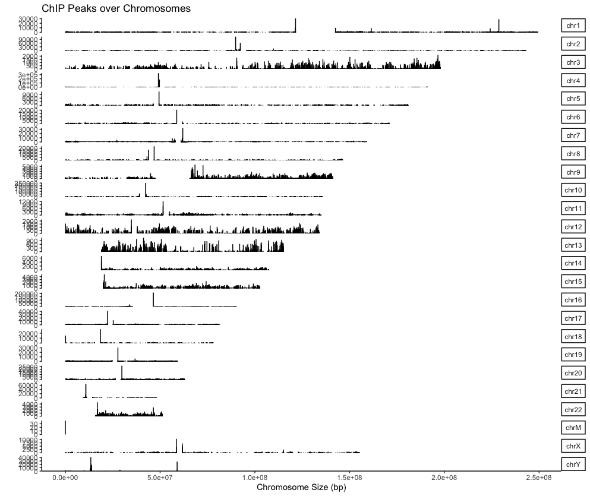

© 2022 Janghyun Choi<br>This work is licensed under a [Creative Commons Attribution-NonCommercial-ShareAlike 4.0 International License](https://creativecommons.org/licenses/by-nc-sa/4.0/).<br> [](http://creativecommons.org/licenses/by-nc-sa/4.0/)

# Exploring ChIP-seq Data with ChIPseeker: An Essential Tool for Peak Annotation
Peak annotation in ChIP-seq data analysis involves identifying genomic features associated with regions of significant enrichment (peaks), such as genes, promoters, enhancers, or other regulatory elements. This process is crucial for understanding the biological significance of the data by linking DNA-protein interactions to specific functional genomic regions. ChIPseeker is a popular R package designed for the annotation and visualization of ChIP-seq data. It supports multiple genome annotations and can be easily integrated with other bioinformatics tools, enhancing its utility. A key strength of ChIPseeker is its ability to provide detailed annotation of peaks with respect to nearest genes and genomic features, along with comprehensive visualization options like pie charts and histograms that summarize the genomic distribution of the peaks. This protocol was created based on **ChIPseeker version 1.32.1** running on a system equipped with an Intel 10th generation i9-10910 processor and 48GB of memory. The test environment includes **R version 4.4.0 under macOS 12.4 environment.**

# Installation ChIPseeker
   [](https://github.com/YuLab-SMU/ChIPseeker) [](https://bioconductor.org/packages/release/bioc/html/ChIPseeker.html) [](https://bioconductor.org/packages/release/bioc/vignettes/ChIPseeker/inst/doc/ChIPseeker.html) [](https://www.bioconductor.org/packages/ChIPseeker) [](http://www.repostatus.org/#active)

1. **Check and install ChIPseeker**
Start by ensuring the BiocManager package is installed, then install ChIPseeker using it:
    ```R
    if (!requireNamespace("BiocManager", quietly=TRUE))
        install.packages("BiocManager")
    ## BiocManager::install("BiocUpgrade") ## you may need this
    BiocManager::install("ChIPseeker")
    ```

2. **Install Required Libraries**
Install additional libraries necessary for ChIPseeker to function properly. These include packages for genomic data manipulation and annotation. You can install these packages manually using the `BiocManager::install("<PackageName>")`. The list of packages is shown below.

    **Dependency list**
    - `GenomeInfoDb`: Utilities for manipulating chromosome names
    - `GenomicRanges`: Representation and manipulation of genomic intervals
    - `GenomicFeatures`: Conveniently import and query gene models
    - `rtracklayer`: R interface to genome annotation files and the UCSC genome browser
    - `clusterProfiler`: statistical analysis and visualization of functional profiles for genes and gene clusters
    - `AnnotationDbi`: Manipulation of SQLite-based annotations
    
    **Genome data list** (**Note,** it depends on the species you want to analyze. In this manual, I only provide the analysis of human and mouse genome.)
    - `TxDb.Mmusculus.UCSC.mm10.knownGene`: Annotation package for TxDb objects for mouse
    - `TxDb.Hsapiens.UCSC.hg19.knownGene`: Annotation package for TxDb objects for human
    - `EnsDb.Mmusculus.v79`: Ensembl based annotation package for mouse
    - `EnsDb.Hsapiens.v86`: Ensembl based annotation package for human
    - `org.Mm.eg.db`: Genome wide annotation for Mouse
    - `org.Hs.eg.db`: Genome wide annotation for human

    **Suggestion**. Before installing each package, check if it is already installed and only install those that are missing. This can save time and avoid unnecessary installations. Here is how you can check and install a package only if it's not already installed:
    ```R
    install_if_missing <- function(package_name) {
        if (!requireNamespace(package_name, quietly = TRUE)) {
            BiocManager::install(package_name)
        } else {
            message(paste(package_name, "is already installed."))
        }
    }

    # List of dependencies
    dependencies <- c("GenomeInfoDb", "GenomicRanges", "GenomicFeatures", 
                    "rtracklayer", "clusterProfiler", "AnnotationDbi")

    # Install dependencies one by one
    lapply(dependencies, install_if_missing)

    # List of genome data packages (Optional)
    genome_data <- c("TxDb.Mmusculus.UCSC.mm10.knownGene", 
                    "TxDb.Hsapiens.UCSC.hg19.knownGene", 
                    "EnsDb.Mmusculus.v79", "EnsDb.Hsapiens.v86",
                    "org.Mm.eg.db", "org.Hs.eg.db")

    # Install genome data packages one by one
    lapply(genome_data, install_if_missing)
    ```

# Step-by-step Running Guide ChIPseeker
In this example, I will use ChIP-seq data that identified enrichment of the histone activation marker H3K4me3 and histone repression marker H3K27me3 and the distribution of MLL1, an H3K4-methylase, and UTX, an H3K27-demethylase, responsible for each marker, in normal keratinocytes.
- **Paper**: **Choi, J.**, & Lee, H. (2024). **MLL1 histone methyltransferase and UTX histone demethylase functionally cooperate to regulate the expression of NRF2 in response to ROS-induced oxidative stress**. *Free Radical Biology and Medicine*, 217, 48-59. [DOI](https://doi.org/10.1016/j.freeradbiomed.2024.03.018)
- **GEO accession**: [GSE250126](https://www.ncbi.nlm.nih.gov/geo/query/acc.cgi?acc=GSE250126)
 
### 1. Load ChIPseeker and its dependency packages
```R
library(ChIPseeker)
library(TxDb.Hsapiens.UCSC.hg19.knownGene)
library(EnsDb.Hsapiens.v86)
library(clusterProfiler)
library(AnnotationDbi)
library(org.Hs.eg.db)
library(ggplot2)
library(ggupset)
library(ggplotify)
library(ggimage)
library(RColorBrewer)
```

### 2. Load peak data
- In this course, we will use peak data acquired with 'sicer'. When using data acquired with 'macs', you can load 'narrow', 'broad', or 'bed' files as you see fit for your analysis.
    ```R
    Sicer_H3K4me3 <- readPeakFile("/Users/jchoi/Desktop/Unt_H3K4me3-W50-G100-islands-summary", header = F)
    Sicer_H3K27me3 <- readPeakFile("/Users/jchoi/Desktop/Unt_H3K27me3-W50-G100-islands-summary", header = F)
    Sicer_MLL1 <- readPeakFile("/Users/jchoi/Desktop/Unt_MLL1-W50-G100-islands-summary", header = F)
    Sicer_UTX <- readPeakFile("/Users/jchoi/Desktop/Unt_UTX-W50-G100-islands-summary", header = F)
    peaks <- list(H3K4me3 = Sicer_H3K4me3, H3K27me3 = Sicer_H3K27me3, MLL1 = Sicer_MLL1, UTX = Sicer_UTX)
    peaks
    ```
    **Output:**
    ```
    > peaks
    $H3K4me3
    GRanges object with 59583 ranges and 5 metadata columns:
            seqnames            ranges strand |        V4        V5           V6         V7           V8
                <Rle>         <IRanges>  <Rle> | <integer> <integer>    <numeric>  <numeric>    <numeric>
        [1]     chr1       10051-10599      * |        53        68    1.0000000   0.924306    1.0000000
        [2]     chr1       11601-14399      * |       171       181    0.0653982   1.120382    0.0695043
        [3]     chr1       14551-15249      * |        34        28    0.0166897   1.440023    0.0182155
        [4]     chr1       15401-17099      * |        73        77    0.1441852   1.124296    0.1513844
        [5]     chr1       17251-18049      * |        38        64    1.0000000   0.704129    1.0000000
        ...      ...               ...    ... .       ...       ...          ...        ...          ...
    [59579]     chrY 59011501-59026949      * |      1413       778 7.55580e-145  2.1538291 4.09978e-144
    [59580]     chrY 59027151-59033299      * |       552       225 1.81527e-101  2.9094120 8.81781e-101
    [59581]     chrY 59213451-59214949      * |        75         5  2.58202e-66 17.7885247  1.10346e-65
    [59582]     chrY 59362851-59363399      * |        25        46  1.00000e+00  0.6445118  1.00000e+00
    [59583]     chrM       12351-13249      * |        39      1856  1.00000e+00  0.0249193  1.00000e+00
    -------
    seqinfo: 25 sequences from an unspecified genome; no seqlengths

    $H3K27me3
    GRanges object with 93824 ranges and 5 metadata columns:
            seqnames      ranges strand |        V4        V5          V6        V7          V8
                <Rle>   <IRanges>  <Rle> | <integer> <integer>   <numeric> <numeric>   <numeric>
        [1]     chr1 31101-31849      * |        41        11 7.52852e-14   4.02644 2.02150e-13
        [2]     chr1 32601-33349      * |        32        13 4.73028e-07   2.65911 7.00814e-07
        [3]     chr1 33701-34499      * |        54        23 8.04691e-10   2.53627 1.53203e-09
        [4]     chr1 34651-35399      * |        40        11 3.12778e-13   3.92823 7.96170e-13
        [5]     chr1 35651-36349      * |        54        11 9.84610e-23   5.30312 4.90046e-22
        ...      ...         ...    ... .       ...       ...         ...       ...         ...
    [93820]     chrM   4751-5899      * |        62      2070           1 0.0323557           1
    [93821]     chrM   6051-6999      * |        46      1885           1 0.0263619           1
    [93822]     chrM  7151-10949      * |       187      6820           1 0.0296202           1
    [93823]     chrM 11101-14399      * |       202      6535           1 0.0333915           1
    [93824]     chrM 14551-16549      * |       131      3655           1 0.0387181           1
    -------
    seqinfo: 25 sequences from an unspecified genome; no seqlengths

    $MLL1
    GRanges object with 34003 ranges and 5 metadata columns:
            seqnames            ranges strand |        V4        V5          V6        V7          V8
                <Rle>         <IRanges>  <Rle> | <integer> <integer>   <numeric> <numeric>   <numeric>
        [1]     chr1       10001-10499      * |        51        63   1.0000000  0.780916   1.0000000
        [2]     chr1       11901-13049      * |        60        92   1.0000000  0.629126   1.0000000
        [3]     chr1       16901-17299      * |        31        22   0.0397828  1.359294   0.0557065
        [4]     chr1       17451-18099      * |        36        49   1.0000000  0.708730   1.0000000
        [5]     chr1       19851-20799      * |        39        44   1.0000000  0.855040   1.0000000
        ...      ...               ...    ... .       ...       ...         ...       ...         ...
    [33999]     chrY 59029651-59030999      * |        91        52 1.48881e-06  1.688156 5.32648e-06
    [34000]     chrY 59031151-59032099      * |        68        30 3.24751e-09  2.186563 2.14925e-08
    [34001]     chrY 59032401-59033199      * |        36        70 1.00000e+00  0.496111 1.00000e+00
    [34002]     chrY 59362951-59363399      * |        85        44 6.37554e-08  1.863548 3.07182e-07
    [34003]     chrM           1-16549      * |      7206     29637 1.00000e+00  0.234549 1.00000e+00
    -------
    seqinfo: 25 sequences from an unspecified genome; no seqlengths

    $UTX
    GRanges object with 44845 ranges and 5 metadata columns:
            seqnames            ranges strand |        V4        V5          V6        V7          V8
                <Rle>         <IRanges>  <Rle> | <integer> <integer>   <numeric> <numeric>   <numeric>
        [1]     chr1       10051-10449      * |        58        59 0.161707386  1.127780 0.178211140
        [2]     chr1       13301-13899      * |        32        35 0.349485362  1.048891 0.373021173
        [3]     chr1       14551-15249      * |        26        28 0.325894887  1.065279 0.348971602
        [4]     chr1       16851-17799      * |        47        76 1.000000000  0.709467 1.000000000
        [5]     chr1       19101-20649      * |        70        53 0.000421408  1.515202 0.000653707
        ...      ...               ...    ... .       ...       ...         ...       ...         ...
    [44841]     chrY 59028701-59029749      * |        40        32 1.17852e-02  1.434030 1.48488e-02
    [44842]     chrY 59030051-59030599      * |        42        24 1.55131e-05  2.007642 3.07036e-05
    [44843]     chrY 59030851-59032599      * |        85        59 6.65690e-06  1.652780 1.41208e-05
    [44844]     chrY 59362901-59363399      * |        45        45 1.57970e-01  1.147224 1.74366e-01
    [44845]     chrM           1-16549      * |      4103     29637 1.00000e+00  0.158824 1.00000e+00
    -------
    seqinfo: 25 sequences from an unspecified genome; no seqlengths
    ```
### 3. Make coverage plot
- Before depict coverage plot, it is important to understand the structure of the `peaks` objects: make sure you know what each column means. The output of 'sicer' is chromosome (**V1; seqnames**), start (**V2; ranges**), end (**V2; ranges**), strand (**V3; strand**), ChIP_signal (**V4**), Input_signal (**V5**), p-val (**V6**), fold change (**V7**), fdr (**V8**), in that order. This means that to draw a coverage plot, you will need values from **V4** or **V7**.
    ```R
    covplot(peaks[["H3K4me3"]], weightCol="V4") # To save the plot, use 'Export' in the 'Plots' section on the right.
    covplot(peaks[["H3K27me3"]], weightCol="V4")
    covplot(peaks[["MLL1"]], weightCol="V4")
    covplot(peaks[["UTX"]], weightCol="V4")

    # Can be selected specific chromosomes as follow:
    covplot(peaks[["H3K4me3"]], weightCol="V4", chrs=c("chr3", "chr4"))
    ```
    **Output:**
    <p align="center">
        
    </p>

### 4. Profile of ChIP peaks binding to TSS regions
- For calculating the profile of ChIP peaks binding to TSS regions, prepare the TSS regions, which are defined as the flanking sequence of the TSS sites. Then align the peaks that are mapping to these regions, and generate the tagMatrix:
    ```R
    txdb <- TxDb.Hsapiens.UCSC.hg19.knownGene
    promoter <- getPromoters(TxDb=txdb, upstream=3000, downstream=3000)
    tagMatrixList <- lapply(as.list(peaks), getTagMatrix, windows=promoter)
    ```
    **Output:**
    ```
    > txdb <- TxDb.Hsapiens.UCSC.hg19.knownGene
    > promoter <- getPromoters(TxDb=txdb, upstream=3000, downstream=3000)
    > tagMatrixList <- lapply(as.list(peaks), getTagMatrix, windows=promoter)
    >> preparing start_site regions by gene... 2024-05-21 12:41:47
    >> preparing tag matrix...  2024-05-21 12:41:47 
    >> preparing start_site regions by gene... 2024-05-21 12:41:56
    >> preparing tag matrix...  2024-05-21 12:41:56 
    >> preparing start_site regions by gene... 2024-05-21 12:42:01
    >> preparing tag matrix...  2024-05-21 12:42:01 
    >> preparing start_site regions by gene... 2024-05-21 12:42:06
    >> preparing tag matrix...  2024-05-21 12:42:06
    ```
- Heatmap of ChIP binding to TSS regions
    ```R
    # Multiplot
    peakHeatmap(peaks, TxDb = txdb, nbin = 100, upstream = 3000, downstream = 3000, 
                by = "gene", type = "start_site", palette = "Reds")
    
    # Individual plot
    peakHeatmap(peaks[["PeakName"]], TxDb = txdb, nbin = 100, upstream = 3000, downstream = 3000, 
                by = "gene", type = "start_site", palette = "Reds")
    ```
    **Key arguments**
    - `peaks`: Path to the peak file or a GRanges object containing peak information.
    - `TxDb`: Transcript Database (TxDb) object.
    - `nbin`: Number of bins to use for drawing the heatmap. Determines the resolution of the heatmap. The lower the `nbin` value, the faster the processing, but the lower the image quality.
    - `upstream`and `downstream`: Distance upstream and downstream of the TSS, respectively.
    - `by`: Category to base the peak heatmap on. Possible values are `gene`, `transcript`, `exon`, `intron`, `3UTR`, `5UTR`, and `UTR`.
    - `type`: Specifies genomic regions to heatmap. Possible values are `start_site`(tss), `end_site`(tes), `body`(gene body).
    - `palette`: Color palette for the heatmap.

    **Output:**
    ```
    > peakHeatmap(peaks, TxDb = txdb, nbin = 100, upstream = 3000, downstream = 3000, 
                by = "gene", type = "start_site", palette = "Reds")
    >> preparing promoter regions...	 2024-05-21 14:38:23 
    >> preparing tag matrix...		 2024-05-21 14:38:23 
    >> binning method is used...2024-05-21 14:38:23
    >> preparing start_site regions by gene... 2024-05-21 14:38:23
    >> preparing tag matrix by binning...  2024-05-21 14:38:23 
    >> binning method is used...2024-05-21 14:38:40
    >> preparing start_site regions by gene... 2024-05-21 14:38:40
    >> preparing tag matrix by binning...  2024-05-21 14:38:40 
    >> binning method is used...2024-05-21 14:38:47
    >> preparing start_site regions by gene... 2024-05-21 14:38:47
    >> preparing tag matrix by binning...  2024-05-21 14:38:47 
    >> binning method is used...2024-05-21 14:38:51
    >> preparing start_site regions by gene... 2024-05-21 14:38:51
    >> preparing tag matrix by binning...  2024-05-21 14:38:51 
    >> generating figure...		 2024-05-21 14:38:54 
    >> done...			 2024-05-21 14:38:54 
    ```
    <p align="center">
        
    </p>

- Average Profile of ChIP peaks binding to TSS region
    ```R
    # Multiplot
    plotAvgProf(tagMatrixList, xlim=c(-3000, 3000), xlab="Genomic Region (5'->3')", ylab = "Read Count Frequency")

    # Selected plot
    plotAvgProf(tagMatrixList[c("H3K4me3", "MLL1")], xlim=c(-3000, 3000), xlab="Genomic Region (5'->3')", ylab = "Read Count Frequency",conf = 0.95, resample = 1000)

    # Selected plot plus confidence interval estimated by bootstrap method
    plotAvgProf(tagMatrixList[c("H3K4me3", "MLL1")], xlim=c(-3000, 3000), xlab="Genomic Region (5'->3')", ylab = "Read Count Frequency",conf = 0.95, resample = 1000)

    # facet
    plotAvgProf(tagMatrixList, xlim=c(-3000, 3000), xlab="Genomic Region (5'->3')", ylab = "Read Count Frequency",conf = 0.95, resample = 500, facet = "row")
    ```
    **Output:**
    ```
    > plotAvgProf(tagMatrixList[c("H3K4me3", "MLL1")], xlim=c(-3000, 3000), xlab="Genomic Region (5'->3')", ylab = "Read Count Frequency",conf = 0.95, resample = 1000)
    >> plotting figure...			 2024-05-21 16:15:42 
    >> Running bootstrapping for tag matrix...		 2024-05-21 16:17:15 
    >> Running bootstrapping for tag matrix...		 2024-05-21 16:17:34 
    ```
    <p align="center">
        
    </p>

- **Adding your own Transcript Database(Txdb)**: Species that are less commonly studied often do not have associated database packages in R. In such cases, it is possible to extract the Txdb simply using `makeTxDbFromGFF` function from the GTF file. In this context, I will use the rice genome as an example to demonstrate the extraction method.
    ```R
    gtf_file <- "/Users/jchoi/Desktop/IRGSP.gtf"
    txdb <- makeTxDbFromGFF(gtf_file)
    ```

### 5. Peak Annotation
- The `annotatePeak` function in the ChIPseeker package is used to annotate peaks in ChIP-seq data analysis. The function identifies and annotates where peaks map to functional elements of the genome, such as **promoters, UTRs (5 and 3), exons, introns, intergenic, and downstream regions**.
    ```R
    peakAnnoList <- lapply(peaks, annotatePeak, TxDb=txdb, tssRegion=c(-3000, 3000),
                    addFlankGeneInfo=TRUE, flankDistance=5000, annoDb="org.Hs.eg.db")
    peakAnnoList # Check results
    ```
    
    **Key arguments**
    - `peaks`: The list of peak files provided as the first argument to the `lapply` function.
    - `TxDb`: Transcript Database (TxDb) object.
    - `tssRegion`: The distance range from the TSS. The default is `c(-3000, 3000)`, which means peaks will be annotated within 3000 base pairs upstream and downstream of the TSS.
    - `addFlankGeneInfo`: Specifies whether to add information about genes flanking the peaks. Setting this to `TRUE` will include information about genes located upstream and downstream of the peaks.
    - `flankDistance`: Specifies the distance upstream and downstream to include when adding flanking gene information. The default is 5000 base pairs.
    - `annoDb`: Specifies annotation database.

    **Output:**
    ```
    > peakAnnoList <- lapply(peaks, annotatePeak, TxDb=txdb, tssRegion=c(-3000, 3000),
    +                        addFlankGeneInfo=TRUE, flankDistance=5000, annoDb="org.Hs.eg.db")
    >> preparing features information...		 2024-05-21 16:51:05 
    >> identifying nearest features...		 2024-05-21 16:51:06 
    >> calculating distance from peak to TSS...	 2024-05-21 16:51:06 
    >> assigning genomic annotation...		 2024-05-21 16:51:06 
    >> adding gene annotation...			 2024-05-21 16:51:17 
    'select()' returned 1:many mapping between keys and columns
    >> adding flank feature information from peaks...	 2024-05-21 16:51:18 
    >> assigning chromosome lengths			 2024-05-21 16:51:26 
    >> done...					 2024-05-21 16:51:26 
    >> preparing features information...		 2024-05-21 16:51:27 
    >> identifying nearest features...		 2024-05-21 16:51:27 
    >> calculating distance from peak to TSS...	 2024-05-21 16:51:27 
    >> assigning genomic annotation...		 2024-05-21 16:51:27 
    >> adding gene annotation...			 2024-05-21 16:51:29 
    'select()' returned 1:many mapping between keys and columns
    >> adding flank feature information from peaks...	 2024-05-21 16:51:29 
    >> assigning chromosome lengths			 2024-05-21 16:51:40 
    >> done...					 2024-05-21 16:51:40 
    >> preparing features information...		 2024-05-21 16:51:41 
    >> identifying nearest features...		 2024-05-21 16:51:41 
    >> calculating distance from peak to TSS...	 2024-05-21 16:51:41 
    >> assigning genomic annotation...		 2024-05-21 16:51:41 
    >> adding gene annotation...			 2024-05-21 16:51:42 
    'select()' returned 1:many mapping between keys and columns
    >> adding flank feature information from peaks...	 2024-05-21 16:51:42 
    >> assigning chromosome lengths			 2024-05-21 16:51:47 
    >> done...					 2024-05-21 16:51:47 
    >> preparing features information...		 2024-05-21 16:51:47 
    >> identifying nearest features...		 2024-05-21 16:51:47 
    >> calculating distance from peak to TSS...	 2024-05-21 16:51:48 
    >> assigning genomic annotation...		 2024-05-21 16:51:48 
    >> adding gene annotation...			 2024-05-21 16:51:51 
    'select()' returned 1:many mapping between keys and columns
    >> adding flank feature information from peaks...	 2024-05-21 16:51:51 
    >> assigning chromosome lengths			 2024-05-21 16:51:56 
    >> done...					 2024-05-21 16:51:56 
    ```
    ```
    > peakAnnoList
    $H3K4me3
    Annotated peaks generated by ChIPseeker
    59582/59583  peaks were annotated
    Genomic Annotation Summary:
                Feature   Frequency
    9    Promoter (<=1kb) 26.79332684
    10   Promoter (1-2kb)  3.96092780
    11   Promoter (2-3kb)  3.49434393
    4              5' UTR  0.47665402
    3              3' UTR  1.22855896
    1            1st Exon  0.64113323
    7          Other Exon  1.96032359
    2          1st Intron  8.64355007
    8        Other Intron 14.83501729
    6  Downstream (<=300)  0.07384781
    5   Distal Intergenic 37.89231647

    $H3K27me3
    Annotated peaks generated by ChIPseeker
    93817/93824  peaks were annotated
    Genomic Annotation Summary:
                Feature   Frequency
    9    Promoter (<=1kb)  7.06801539
    10   Promoter (1-2kb)  2.79693446
    11   Promoter (2-3kb)  2.69354168
    4              5' UTR  0.65020199
    3              3' UTR  1.85467453
    1            1st Exon  0.41250520
    7          Other Exon  4.55994116
    2          1st Intron  9.31600883
    8        Other Intron 18.78977158
    6  Downstream (<=300)  0.09379963
    5   Distal Intergenic 51.76460556

    $MLL1
    Annotated peaks generated by ChIPseeker
    34002/34003  peaks were annotated
    Genomic Annotation Summary:
                Feature   Frequency
    9    Promoter (<=1kb)  7.42015176
    10   Promoter (1-2kb)  3.70566437
    11   Promoter (2-3kb)  3.32921593
    4              5' UTR  0.78230692
    3              3' UTR  2.30574672
    1            1st Exon  0.44997353
    7          Other Exon  6.15846127
    2          1st Intron  8.86124346
    8        Other Intron 23.65743192
    6  Downstream (<=300)  0.07940709
    5   Distal Intergenic 43.25039704

    $UTX
    Annotated peaks generated by ChIPseeker
    44844/44845  peaks were annotated
    Genomic Annotation Summary:
                Feature  Frequency
    9    Promoter (<=1kb)  3.1375435
    10   Promoter (1-2kb)  3.3850682
    11   Promoter (2-3kb)  3.1643029
    4              5' UTR  0.4147712
    3              3' UTR  1.2576933
    1            1st Exon  0.3255731
    7          Other Exon  3.0171260
    2          1st Intron 10.2600125
    8        Other Intron 27.2277228
    6  Downstream (<=300)  0.1204174
    5   Distal Intergenic 47.6897690
    ```
- Save annotated peaks as the csv format as follow:
    ```R
    write.csv(peakAnnoList[["H3K4me3"]], "Peaked_H3K4me3.csv")
    write.csv(peakAnnoList[["H3K27me3"]], "Peaked_H3K27me3.csv")
    write.csv(peakAnnoList[["MLL1"]], "Peaked_MLL1.csv")
    write.csv(peakAnnoList[["UTX"]], "Peaked_UTX.csv")
    ```

### 6. Visulize genomic annotation
- Finally, I will discuss and visualize where the annotated peaks are located in the genomic regions, including **promoters, UTRs (5 and 3), exons, introns, intergenic, and downstream regions**.
- **Pie plot**: This funtion does not provide drawing multiplot.
    ```R
    plotAnnoPie(peakAnnoList[["PeakName"]]) # PeakName is an assigned peak name using the list function

    # For example
    plotAnnoPie(peakAnnoList[["H3K4me3"]]) # Ouput
    ```
    **Output:**
    <p align="center">
        
    </p>
- **Bar plot**
    ```R
    plotAnnoBar(peakAnnoList) # Multiplot, output
    plotAnnoBar(peakAnnoList[["PeakName"]]) # Indivisual plot
    ```
    **Output:**
    <p align="center">
        
    </p>
- **Vennpie plot**: This funtion does not provide drawing multiplot.
    ```R
    vennpie(peakAnnoList[["PeakName"]])
    ```
- **UpSet plot**: This funtion does not provide drawing multiplot.
    ```R
    upsetplot(peakAnnoList[["PeakName"]], vennpie = TRUE) # TRUE/FALSE: with/without vennpie, output
    ```
    **Output:**
    <p align="center">
        
    </p>
- **Distribution of TF-binding loci relative to TSS**: The distance from the peak (binding site) to the TSS of the nearest gene is calculated by annotatePeak and reported in the output.
    ```R
    plotDistToTSS(peakAnnoList) # output
    plotDistToTSS(peakAnnoList[["PeakName"]])
    ```
    **Output:**
    <p align="center">
        
    </p>

### Comments
1. The annotated peak data is crucial for analyzing ChIP-seq data.
2. The same annotation method (`annotatePeak`) can be conducted using `dbgdiff` in MACS3 or `sicer-df` in SICER2 (refer to the example code folder for details).
3. Although the annotation method can also be performed using the `annotatePeaks.pl`of the HOMER, it is currently seldom used.
4. Peak distribution analysis, including heatmap and average plot, can be performed similarly with both `deeptools`and `ngsplot`. I recommend `ngsplot` to be the most effective tool for this purpose.
5. Peak feature analysis (section 6) is a function that is infrequently utilized unless ChIP-seq for a novel transcription factor.
6. Despite the effort invested in detailed peak analysis, the current trend is to identify meaningful genes from the detected peaks.

# Citation
### ChIPSeeker
**Yu, G.**, Wang, L. G., & He, Q. Y. (2015). **ChIPseeker: an R/Bioconductor package for ChIP peak annotation, comparison and visualization**. *Bioinformatics*, 31(14), 2382-2383. [DOI](https://doi.org/10.1093/bioinformatics/btv145)