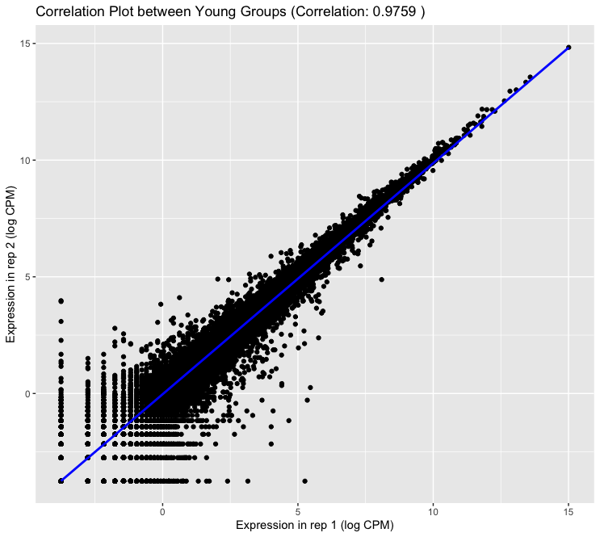
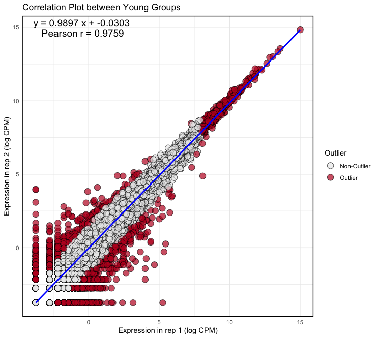
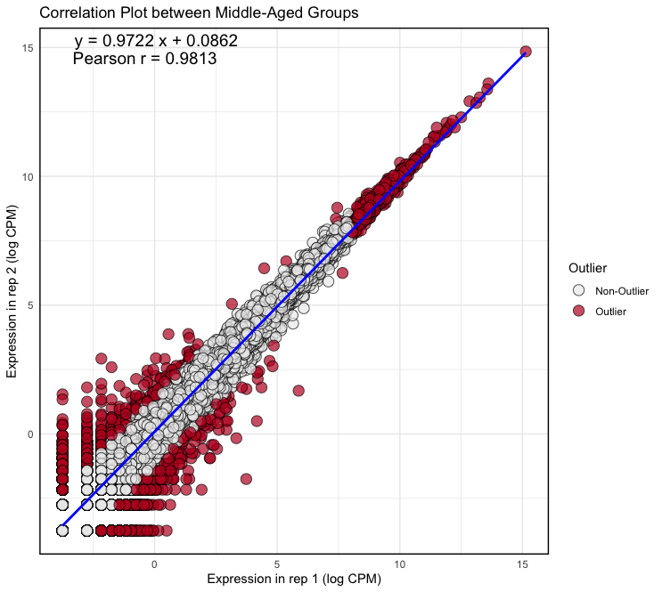
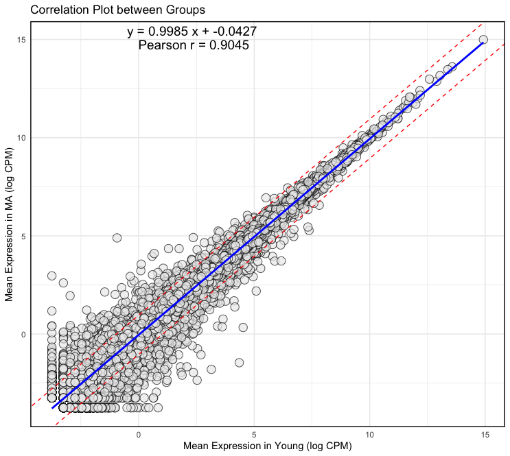
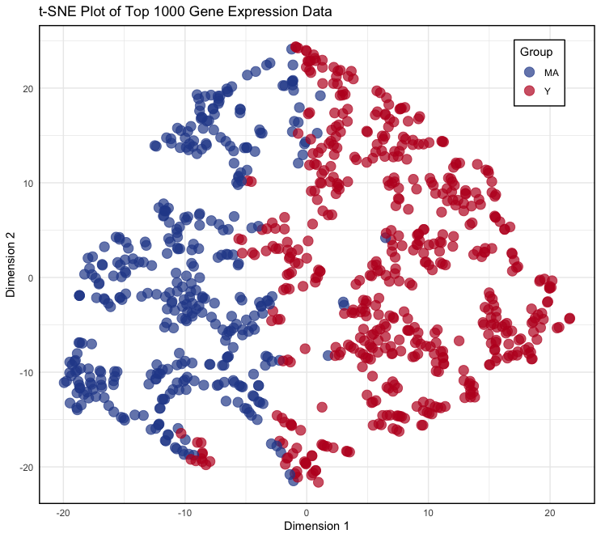

© 2022 Janghyun Choi<br>This work is licensed under a [Creative Commons Attribution-NonCommercial-ShareAlike 4.0 International License](https://creativecommons.org/licenses/by-nc-sa/4.0/).<br> [](http://creativecommons.org/licenses/by-nc-sa/4.0/)


### Important Notice
The dataset utilized in this section comprises two replicate samples of five zebrafish brains each (replicate 1/rep 1 and replicate 2/rep 2). The fish were categorized into two groups based on age: 3-month-old and 12-month-old, which serve as the independent variables. All RNA-seq data processing was conducted in accordance with the instructions outlined in this protocol. It is important to note that this dataset is pre-publication and has not yet been submitted to the GEO database.

# Correlation Plot
The correlation plot is used to visualize the relationship between two replicates of log-transformed counts per million (CPM) values. This plot helps to understand the consistency and reliability of the measurements across the replicates. This protocol was developed using a system equipped with an Intel 10th generation i9-10910 processor and 48GB of memory. The test environment includes **R version 4.4.0 running on macOS 14.4.1**.

**Required Packages:**
```R
library(ggplot2) 
library(ggrepel)
library(egg)
```

### Step-by-Step Guide Between Biological Replicates
Add file source, PCA MDS plot
1. **Load Your CPM Data as Base Type**
  - Load the CPM data from a CSV file into a data frame. Ensure that the first row contains headers and the first column contains row names:
    ```R
    logcpm <- read.csv("cpmlog.csv", head = T, row.names = 1)
    ```
- Example of the first few rows of the data:
  ```
    > head(logcpm)
                        MA_rep1  MA_rep2   Y_rep1   Y_rep2
    ENSDARG00000000001 4.520536 4.359122 4.668621 4.243662
    ENSDARG00000000002 4.064591 3.908802 3.991407 3.714391
    ENSDARG00000000018 5.781629 5.705938 5.891582 5.955444
    ENSDARG00000000019 7.903514 7.711072 7.884873 7.745864
    ENSDARG00000000068 3.844325 3.642902 3.769026 3.906018
    ENSDARG00000000069 3.584263 3.828018 3.533662 4.049387
  ```

2. **Calculate Correlation and Linear Model**
- Calculate the Pearson correlation coefficient and fit a linear model to the data:
    ```R
    correlation <- cor(logcpm$Y_rep1, logcpm$Y_rep2, method = "pearson") # Possible methods are "pearson", "spearman", and "kendall" (default: "pearson")
    model <- lm(Y_rep2 ~ Y_rep1, data = logcpm)
    coefficients <- coef(model)
    slope <- coefficients["Y_rep1"]
    intercept <- coefficients["(Intercept)"]
    equation <- paste("y =", round(slope, 4), "x +", round(intercept, 4))
    cor_text <- paste("Pearson r =", round(correlation, 4))
    ```

3. **Make the correlation plot**
- Use ggplot2 to create the correlation plot, adding points, and a linear regression line:
    ```R
    ggplot(logcpm, aes(x = Y_rep1, y = Y_rep2)) +
    geom_point() +
    geom_smooth(method = lm, color = "blue") +
    xlab("Expression in rep 1 (log CPM)") +
    ylab("Expression in rep 2 (log CPM)") +
    ggtitle(paste("Correlation Plot between Young Groups (Correlation:", round(correlation, 4), ")"))
    ```
- **Output:**
    <p align="center">
        
    </p>

4. **Identify Outliers**
- Calculate standardized residuals, Cook's distance, and leverage values to identify outliers:
    ```R
    std_residuals <- rstandard(model)
    cooks_d <- cooks.distance(model)
    leverages <- hatvalues(model)
    logcpm$outlier <- (abs(std_residuals) > 2) | (cooks_d > 4/nrow(logcpm)) | (leverages > 2*mean(leverages))
    ```

5. **Create the Correlation Plot with Outliers Highlighted**
- Update the plot to highlight outliers in red:
    ```R
    plot <- ggplot(logcpm, aes(x = Y_rep1, y = Y_rep2)) +
        geom_point(aes(fill = factor(outlier)), size = 4, shape = 21, 
                    alpha = 0.7, stroke = 0.5) +
        geom_smooth(method = lm, color = "blue") +
        scale_fill_manual(values = c("FALSE" = "#ECECEC", "TRUE" = "#BE1826"), 
                            name = "Outlier", 
                            labels = c("FALSE" = "Non-Outlier", "TRUE" = "Outlier")) +
        theme_minimal() +
        theme(panel.border = element_rect(color = "black", fill = NA, size = 1)) +
        xlab("Expression in rep 1 (log CPM)") +
        ylab("Expression in rep 2 (log CPM)") +
        ggtitle("Correlation Plot between Young Groups") +
        annotate("text", x = Inf, y = Inf, label = equation, hjust = 2.9, vjust = 1.5, size = 5, color = "black") +
        annotate("text", x = Inf, y = Inf, label = cor_text, hjust = 3.3, vjust = 3, size = 5, color = "black")
    ```
- **Output:**
<p align="center">
    
    
</p>

### Summarize
```R
logcpm <- read.csv("cpmlog.csv", head = T, row.names = 1)

correlation <- cor(logcpm$Y_rep1, logcpm$Y_rep2, method = "pearson") 
model <- lm(Y_rep2 ~ Y_rep1, data = logcpm)
coefficients <- coef(model)
slope <- coefficients["Y_rep1"]
intercept <- coefficients["(Intercept)"]
equation <- paste("y =", round(slope, 4), "x +", round(intercept, 4))
cor_text <- paste("Pearson r =", round(correlation, 4))

std_residuals <- rstandard(model)
cooks_d <- cooks.distance(model)
leverages <- hatvalues(model)
logcpm$outlier <- (abs(std_residuals) > 2) | (cooks_d > 4/nrow(logcpm)) | (leverages > 2*mean(leverages))

plot <- ggplot(logcpm, aes(x = Y_rep1, y = Y_rep2)) +
    geom_point(aes(fill = factor(outlier)), size = 4, shape = 21, 
                alpha = 0.7, stroke = 0.5) +
    geom_smooth(method = lm, color = "blue") +
    scale_fill_manual(values = c("FALSE" = "#ECECEC", "TRUE" = "#BE1826"), 
                        name = "Outlier", 
                        labels = c("FALSE" = "Non-Outlier", "TRUE" = "Outlier")) +
    theme_minimal() +
    theme(panel.border = element_rect(color = "black", fill = NA, size = 1)) +
    xlab("Expression in rep 1 (log CPM)") +
    ylab("Expression in rep 2 (log CPM)") +
    ggtitle("Correlation Plot between Young Groups") +
    annotate("text", x = Inf, y = Inf, label = equation, hjust = 2.9, vjust = 1.5, size = 5, color = "black") +
    annotate("text", x = Inf, y = Inf, label = cor_text, hjust = 3.3, vjust = 3, size = 5, color = "black")

# Adjust plot size for publication
plot2 <- set_panel_size(plot, width = unit(49, "mm"), height = unit(49, "mm"))
grid.arrange(plot2)
```

### Step-by-Step Guide Between Groups (Conditions)

1. **Load the Data and Calculate the Mean Across Replicas in each Group.**
    ```R
    logcpm <- read.csv("cpmlog.csv", head = T, row.names = 1)
    logcpm$MA_mean <- rowMeans(logcpm[, c("MA_rep1", "MA_rep2")])
    logcpm$Y_mean <- rowMeans(logcpm[, c("Y_rep1", "Y_rep2")])
    ```

2. **Calculate Correlation and Linear Model**
- Calculate the Pearson correlation coefficient and fit a linear model to the data:
    ```R
    correlation <- cor(logcpm$Y_mean, logcpm$MA_mean, method = "pearson") 
    model <- lm(MA_mean ~ Y_mean, data = logcpm)
    coefficients <- coef(model)
    slope <- coefficients["Y_mean"]
    intercept <- coefficients["(Intercept)"]
    equation <- paste("y =", round(slope, 4), "x +", round(intercept, 4))
    cor_text <- paste("Pearson r =", round(correlation, 4))
    ```
3. **Make the correlation plot**
- Use ggplot2 to create the correlation plot, adding points, and a linear regression line:
```R
plot <- ggplot(logcpm, aes(x = Y_mean, y = MA_mean)) +
    geom_point(fill = "#ECECEC", size = 4, shape = 21, alpha = 0.7, stroke = 0.5) +
    geom_smooth(method = lm, color = "blue") +
    geom_abline(slope = slope, intercept = intercept + 1, color = "red", linetype = "dashed") +
    geom_abline(slope = slope, intercept = intercept - 1, color = "red", linetype = "dashed") +
    theme_minimal() +
    theme(panel.border = element_rect(color = "black", fill = NA, size = 1)) +
    xlab("Mean Expression in Young (log CPM)") +
    ylab("Mean Expression in MA (log CPM)") +
    ggtitle("Correlation Plot between Groups") +
    annotate("text", x = Inf, y = Inf, label = equation, hjust = 2.9, vjust = 1.5, size = 5, color = "black") +
    annotate("text", x = Inf, y = Inf, label = cor_text, hjust = 3.3, vjust = 3, size = 5, color = "black")
```
- **Output:**
    <p align="center">
        
    </p>

# t-SNE Plot
The t-SNE (t-Distributed Stochastic Neighbor Embedding) plot is used to visualize high-dimensional gene expression data in a two-dimensional space. This plot helps to reveal patterns and clusters in the data, allowing for the identification of similarities and differences between groups of samples. By reducing the dimensionality of the data while preserving its structure, t-SNE provides an intuitive way to explore and understand complex biological datasets. This protocol was developed using a system equipped with an Intel 10th generation i9-10910 processor and 48GB of memory. The test environment includes **R version 4.4.0 running on macOS 14.4.1**.

**Required Packages:**
```R
library(ggplot2) 
library(Rtsne)
```

### Step-by-Step t-SNE Guide

1. **Load CPM Data and Prepare Analytic Data Set**
- Load the CPM data from a CSV file into a data frame, and select the analytic data:
    ```R
    logcpm <- read.csv("cpmlog.csv", header = TRUE, row.names = 1)
    group <- factor(c("MA", "MA", "Y", "Y"))
    top_genes <- head(order(apply(logcpm, 1, var), decreasing = TRUE), 1000)
    logcpm_top <- logcpm[top_genes, ]
    logcpm_unique <- logcpm_top[!duplicated(logcpm_top), ]
    gene_groups <- ifelse(rowMeans(logcpm_unique[, group == "MA"]) > rowMeans(logcpm_unique[, group == "Y"]), "MA", "Y")
    ```
- In these codes:
    - **Line 2** (`factor` syntax): Create a factor vector for your sample groups.
    - **Line 3 and 4** (`apply`syntax): Select the top 1000 genes based on variance.
    - **Line 5**: Remove duplicate rows to avoid issues with t-SNE.
    - **Line 6** (`ifelse` syntax): Assign each gene to a group based on the average expression in each sample group (*If the average expression in the `MA` group is higher, assign `MA`; otherwise, assign `Y`*).

2. **Perform t-SNE** 
- Set the seed for reproducibility and run the t-SNE algorithm:
    ```R
    set.seed(42) 
    tsne_res <- Rtsne(as.matrix(logcpm_unique), dims = 2, perplexity = 30, verbose = TRUE, max_iter = 500)
    ```
- In these codes,
    - **Line 1**: Set the seed for the random number generator. The number `42` is commonly used due to its reference in "The Hitchhiker's Guide to the Galaxy" as the "answer to the ultimate question of life, the universe, and everything." **Setting the seed ensures that the same results can be reproduced.**
    - **Line 2**: `as.matrix(logcpm_unique)` converts the data to a matrix format for t-SNE analysis. `dims = 2` reduces the data to 2 dimensions. `perplexity = 30` controls the local clustering of data points, **typically set between 1/3 and 1/10 of the number of data points**. Here, it is set to `30` for 1000 genes. `max_iter = 500` sets the maximum number of iterations to 500.

- **Output**:
    ```
    > tsne_res <- Rtsne(as.matrix(logcpm_unique), dims = 2, perplexity = 30, verbose = TRUE, max_iter = 500)
    Performing PCA
    Read the 921 x 4 data matrix successfully!
    Using no_dims = 2, perplexity = 30.000000, and theta = 0.500000
    Computing input similarities...
    Building tree...
    Done in 0.05 seconds (sparsity = 0.121822)!
    Learning embedding...
    Iteration 50: error is 69.750356 (50 iterations in 0.07 seconds)
    Iteration 100: error is 65.012543 (50 iterations in 0.07 seconds)
    Iteration 150: error is 64.965118 (50 iterations in 0.07 seconds)
    Iteration 200: error is 64.972655 (50 iterations in 0.07 seconds)
    Iteration 250: error is 64.978724 (50 iterations in 0.07 seconds)
    Iteration 300: error is 1.027332 (50 iterations in 0.06 seconds)
    Iteration 350: error is 0.899678 (50 iterations in 0.06 seconds)
    Iteration 400: error is 0.872497 (50 iterations in 0.07 seconds)
    Iteration 450: error is 0.863688 (50 iterations in 0.06 seconds)
    Iteration 500: error is 0.856872 (50 iterations in 0.06 seconds)
    Fitting performed in 0.67 seconds.
    ```

3. **Visualization**
- Transform the t-SNE results into a data frame and create the plot:
    ```R
    tsne_data <- data.frame(tsne_res$Y, Group = gene_groups)
    colnames(tsne_data) <- c("Dim1", "Dim2", "Group")
    p <- ggplot(data = tsne_data, aes(x = Dim1, y = Dim2)) +
        geom_point(aes(color = Group, fill = Group), size = 4, shape = 21, 
                    alpha = 0.7, stroke = 0.5) +
        scale_fill_manual(values = c("MA" = "#294A99", "Y" = "#BE1826")) + 
        scale_color_manual(values = c("MA" = "#294A99", "Y" = "#BE1826")) + 
        theme_minimal() +
        theme(
            legend.position = c(0.9, 0.9), 
            legend.background = element_rect(fill = "white", color = "black", size = 0.5), 
            panel.border = element_rect(color = "black", fill = NA, size = 1)
        ) +
        labs(title = "t-SNE Plot of Top 1000 Gene Expression Data",
            x = "Dimension 1",
            y = "Dimension 2")
    ```
- In these codes,
    - **Line 1**: Combine the t-SNE results (`tsne_res`) with the group information into a data frame.
    - **Line 2**: Rename the columns for clarity.
    - **Line 3**: Make a plot using ggplot2.

- **Output:**
    <p align="center">
        
    </p>

### Summarize
```R
logcpm <- read.csv("cpmlog.csv", header = TRUE, row.names = 1)
group <- factor(c("MA", "MA", "Y", "Y"))
top_genes <- head(order(apply(logcpm, 1, var), decreasing = TRUE), 1000)
logcpm_top <- logcpm[top_genes, ]
logcpm_unique <- logcpm_top[!duplicated(logcpm_top), ]
gene_groups <- ifelse(rowMeans(logcpm_unique[, group == "MA"]) > rowMeans(logcpm_unique[, group == "Y"]), "MA", "Y")

set.seed(42) 
tsne_res <- Rtsne(as.matrix(logcpm_unique), dims = 2, perplexity = 30, verbose = TRUE, max_iter = 500)
tsne_data <- data.frame(tsne_res$Y, Group = gene_groups)
colnames(tsne_data) <- c("Dim1", "Dim2", "Group")

p <- ggplot(data = tsne_data, aes(x = Dim1, y = Dim2)) +
    geom_point(aes(color = Group, fill = Group), size = 4, shape = 21, 
                alpha = 0.7, stroke = 0.5) +
    scale_fill_manual(values = c("MA" = "#294A99", "Y" = "#BE1826")) + 
    scale_color_manual(values = c("MA" = "#294A99", "Y" = "#BE1826")) + 
    theme_minimal() +
    theme(
        legend.position = c(0.9, 0.9), 
        legend.background = element_rect(fill = "white", color = "black", size = 0.5), 
        panel.border = element_rect(color = "black", fill = NA, size = 1)
    ) +
    labs(title = "t-SNE Plot of Top 1000 Gene Expression Data",
        x = "Dimension 1",
        y = "Dimension 2")

# Adjust plot size for publication
p2 <- set_panel_size(p, width = unit(49, "mm"), height = unit(49, "mm"))
grid.arrange(p2)
```

# Citations
### Linear regression using the R package.
**Fox, J.**, & Weisberg, S. (2018). **An R companion to applied regression**. *Sage publications*. [HTML](https://socialsciences.mcmaster.ca/jfox/Books/Companion/index.html)

### ggplot2
**Wilkinson, L.** (2011). **ggplot2: elegant graphics for data analysis by WICKHAM, H**. [DOI](https://doi.org/10.1111/j.1541-0420.2011.01616.x)

### t-SNE
**Van der Maaten, L.**, & Hinton, G. (2008). **Visualizing data using t-SNE**. *Journal of machine learning research*, 9(11). [HTML](http://jmlr.org/papers/v9/vandermaaten08a.html)