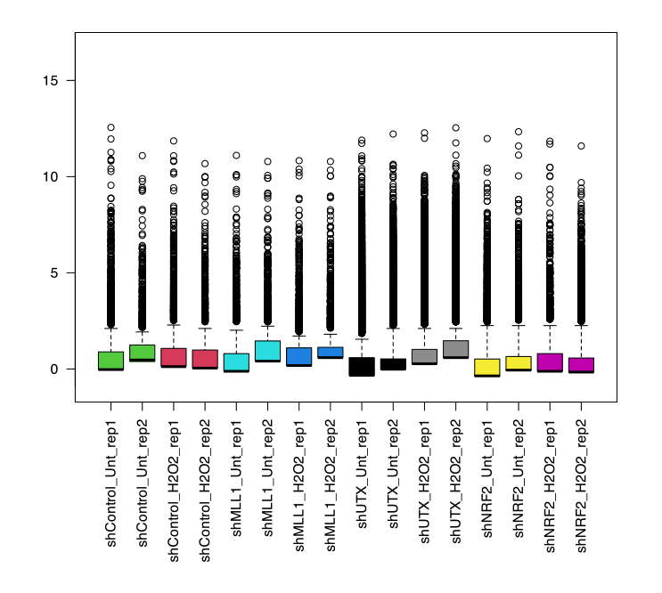
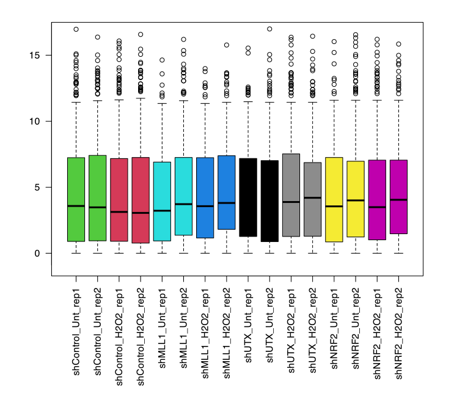

© 2022 Janghyun Choi<br>This work is licensed under a [Creative Commons Attribution-NonCommercial-ShareAlike 4.0 International License](https://creativecommons.org/licenses/by-nc-sa/4.0/).<br> [](http://creativecommons.org/licenses/by-nc-sa/4.0/)

### Important Notice
The dataset used in this section comprises biological replicate samples of human keratinocytes (HaCaT) and their derived knockdown cell lines. The cell lines were categorized into two groups, before and after hydrogen peroxide (H2O2) treatment, and were used as independent variables. All RNA-seq data processing was conducted according to the instructions described in this protocol. Portions of the data have been published in the following papers and deposited in the GEO database under the following accession numbers.
- **Paper**: **Choi, J.**, & Lee, H. (2024). **MLL1 histone methyltransferase and UTX histone demethylase functionally cooperate to regulate the expression of NRF2 in response to ROS-induced oxidative stress**. *Free Radical Biology and Medicine*, 217, 48-59. [DOI](https://doi.org/10.1016/j.freeradbiomed.2024.03.018)
- **GEO accession**: [GSE250127](https://www.ncbi.nlm.nih.gov/geo/query/acc.cgi?acc=GSE250127) 

# Advanced RNA-seq Data Analysis with EdgeR: Identifying Differentially Expressed Genes and Beyond
EdgeR is a powerful tool designed for the data analysis phase of RNA-seq experiments, specifically for identifying differentially expressed genes (DEGs) across various conditions. It employs a negative binomial model to account for overdispersion in count data and uses empirical Bayes methods to stabilize variance estimates. Key features include effective normalization techniques, robust statistical testing for DEGs, and comprehensive visualization tools. While both EdgeR and DESeq are popular tools for RNA-seq data analysis, EdgeR is particularly noted for its flexibility and performance with small sample sizes due to its advanced empirical Bayes methods for dispersion estimation. This makes EdgeR especially useful in experiments where the number of biological replicates is limited. Additionally, EdgeR offers extensive options for data exploration and visualization, enhancing its utility in deriving meaningful biological insights. This protocol was created based on **edgeR version 4.1.2** running on a system equipped with an Intel 10th generation i9-10910 processor and 48GB of memory. The test environment includes **R version 4.4.0 under macOS 12.4 environment.**

# The Importance of Normalization
RNA-seq data analysis requires normalization to fairly compare samples by accounting for differences in sequencing depth and library size. For example, suppose the control group and drug-treated group have the following counts for genes A, B, C, D, and E. In the control group, the counts are 100, 200, 300, 400, and 500, respectively. In the drug-treated group, the counts are 100, 200, 300, 400, and 2000, respectively. The total counts for the control group and drug-treated group are 1500 (100+200+300+400+500) and 3000 (100+200+300+400+2000), respectively. At first glance, the gene expression levels seem identical between the groups. However, normalization reveals a different picture (see the bellow table).

#### Normalized Values
| Gene | Control Group | Drug-Treated Group |
|------|----------------|--------------------|
| A    | 100/1500 = **0.067** | 100/3000 = **0.033**   |
| B    | 200/1500 = **0.133** | 200/3000 = **0.067**   |
| C    | 300/1500 = **0.2**   | 300/3000 = **0.1**     |
| D    | 400/1500 = **0.267** | 400/3000 = **0.133**   |
| E    | 500/1500 = **0.333** | 2000/3000 = **0.667**  |

Normalized values indicate that genes A, B, C, and D are relatively less expressed in the drug-treated group, while gene E is significantly more expressed. Although the raw counts are the same, normalization considers the total count differences between samples. **Sometimes people try to determine gene expression trends by looking at read counts alone. This is never a scientific method and always requires normalization and statistical analysis.**

In practice, EdgeR employs more sophisticated normalization methods beyond simple division by total counts. EdgeR uses the TMM (Trimmed Mean of M-values) method to calculate normalization factors, adjusting for sequencing depth and library size differences:
1. **Calculate \( M \) and \( A \) values**:
     $$\displaystyle
     M = \log_2 \left(\frac{X}{\bar{X}}\right) - \log_2 \left(\frac{Y}{\bar{Y}}\right)
     $$

     $$\displaystyle
     A = \frac{1}{2} \left(\log_2(X) + \log_2(Y)\right)
     $$
- *X*: Read count for a particular gene in sample 1, \(\bar{X}\): Geometric mean of read counts in sample 1
- *Y*: Read count for the same gene in sample 2, \(\bar{Y}\): Geometric mean of read counts in sample 2
2. **Compute the weight (\( w \))**:
     $$\displaystyle
     w = \frac{\text{Trimmed mean of } M}{\log_2(\bar{Y}/\bar{X})}
     $$

- The weight \( w \) is used to normalize the read counts, reducing technical variability and allowing for more accurate comparison of gene expression levels between samples.

This complex normalization reduces technical variability and enhances the detection of genuine biological differences. EdgeR combines this advanced normalization with robust statistical techniques to accurately identify differentially expressed genes. 

# Installation edgeR
   [](https://bioconductor.org/packages/release/bioc/html/edgeR.html) [](https://bioconductor.org/packages/release/bioc/html/edgeR.html) [](https://bioconductor.org/checkResults/release/bioc-LATEST/edgeR/)

1. **Check and install edgeR**
Start by ensuring the BiocManager package is installed, then install edgeR using it:
    ```R
    if (!require("BiocManager", quietly = TRUE))
    install.packages("BiocManager")

    BiocManager::install("edgeR")
    ```

2. **Install Required Libraries**
Install additional libraries necessary for edgeR to function properly. You can install these packages manually using the `BiocManager::install("PackageName")`. The list of packages is shown below.

    **Library list (`PackageName`)**
    - `limma`: EdgeR dependent package
    - `HTSFilter`: A filtering tool for a global Jaccard similarity index
    - `MASS`: Functions and datasets to support Venables and Ripley
    - `lattice`: For trellis graphics system
    - `mixOmics`: For multivariate methods
    - `biomaRt`: For annotation 
    - `ggplot2`
    - `RColorBrewer`
    - `rtracklayer`
    - `GenomeInfoDb`

# Step-by-Step Running Guide edgeR
### 1. Load edgeR and its dependency packages
```R
library(edgeR)
library(limma) 
library(biomaRt) 
library(ggplot2)
library(RColorBrewer) 
library(stats) # For PCA plot
library(data.table)
```

### 2. Prepare metadata
- Metadata in RNA-seq is used to organize samples, adjust statistical models, ensure reproducibility, facilitate comparisons, and manage data effectively. **Note**, the metadata must be associated with the raw count table. This file can be created in Excel, saved as a `csv` and `txt`, and imported via `read.csv` and `read.table`, or it can be created by typing directly in R as shown below.
    ```R
    File <- c("shControl_Unt_rep1", "shControl_Unt_rep2", "shControl_H2O2_rep1", "shControl_H2O2_rep2",
            "shMLL1_Unt_rep1", "shMLL1_Unt_rep2", "shMLL1_H2O2_rep1", "shMLL1_H2O2_rep2", "shUTX_Unt_rep1",
            "shUTX_Unt_rep2", "shUTX_H2O2_rep1", "shUTX_H2O2_rep2", "shNRF2_Unt_rep1", "shNRF2_Unt_rep2",
            "shNRF2_H2O2_rep1", "shNRF2_H2O2_rep2")
    Rep <- c("rep1", "rep2", "rep1", "rep2", "rep1", "rep2", "rep1", "rep2", "rep1", "rep2", "rep1", "rep2",
            "rep1", "rep2", "rep1", "rep2")
    Condition <- c("Unt", "Unt", "H2O2", "H2O2", "Unt", "Unt", "H2O2", "H2O2", "Unt", "Unt", "H2O2", "H2O2",
                "Unt", "Unt", "H2O2", "H2O2")
    KD <- c("WT", "WT", "WT", "WT", "MLL1", "MLL1", "MLL1", "MLL1", "UTX", "UTX", "UTX", "UTX", "NRF2", "NRF2",
            "NRF2", "NRF2")
    Group <- c("CU", "CU", "CH", "CH", "MU", "MU", "MH", "MH", "UU", "UU", "UH", "UH", "NU", "NU", "NH", "NH")
    sampleInfo <- data.frame(File, Rep, KD, Condition, Group)
    sampleInfo # Check metadata
    ```
    **Output:**
    ```
    > sampleInfo
                    File  Rep   KD Condition Group
    1   shControl_Unt_rep1 rep1   WT       Unt    CU
    2   shControl_Unt_rep2 rep2   WT       Unt    CU
    3  shControl_H2O2_rep1 rep1   WT      H2O2    CH
    4  shControl_H2O2_rep2 rep2   WT      H2O2    CH
    5      shMLL1_Unt_rep1 rep1 MLL1       Unt    MU
    6      shMLL1_Unt_rep2 rep2 MLL1       Unt    MU
    7     shMLL1_H2O2_rep1 rep1 MLL1      H2O2    MH
    8     shMLL1_H2O2_rep2 rep2 MLL1      H2O2    MH
    9       shUTX_Unt_rep1 rep1  UTX       Unt    UU
    10      shUTX_Unt_rep2 rep2  UTX       Unt    UU
    11     shUTX_H2O2_rep1 rep1  UTX      H2O2    UH
    12     shUTX_H2O2_rep2 rep2  UTX      H2O2    UH
    13     shNRF2_Unt_rep1 rep1 NRF2       Unt    NU
    14     shNRF2_Unt_rep2 rep2 NRF2       Unt    NU
    15    shNRF2_H2O2_rep1 rep1 NRF2      H2O2    NH
    16    shNRF2_H2O2_rep2 rep2 NRF2      H2O2    NH
    ```

### 3. Load raw count table
- This example is based on the raw count table obtained via htseq-count.
- The raw count table is a tab-delimited .txt file where the first column contains gene or transcript IDs, and the remaining columns are the names of each sample. However, it lacks a header, making columns difficult to distinguish, and the last four rows contain summary information.
- While you can open this file in Excel to add a header and remove the last 4 lines, I will perform these steps programmatically in R.
    ```R
    rawCountTable <- read.delim("~/Desktop/H2O2.txt", header = FALSE, row.names = NULL)
    rawCountTable <- rawCountTable[1:(nrow(rawCountTable) - 4), ]
    rownames(rawCountTable) <- rawCountTable[,1]
    rawCountTable <- rawCountTable[,-1]
    colnames(rawCountTable) <- c("shControl_Unt_rep1", "shControl_Unt_rep2", "shControl_H2O2_rep1",
                            "shControl_H2O2_rep2", "shMLL1_Unt_rep1", "shMLL1_Unt_rep2", "shMLL1_H2O2_rep1",
                            "shMLL1_H2O2_rep2", "shUTX_Unt_rep1", "shUTX_Unt_rep2", "shUTX_H2O2_rep1",
                            "shUTX_H2O2_rep2", "shNRF2_Unt_rep1", "shNRF2_Unt_rep2", "shNRF2_H2O2_rep1",
                            "shNRF2_H2O2_rep2")
    head(rawCountTable) # Check raw count table

    # After processing the data in Excel, you can load it in R using the following command:
    rawCountTable <- read.csv("~/Desktop/H2O2.csv", header = TRUE, row.names = 1)
    rawCountTable <- read.table("/path/to/the/file.txt", sep = ",", header = TRUE, row.names = 1)
    ```
    **Output:**
    ```
    > head(rawCountTable)
                    shControl_Unt_rep1 shControl_Unt_rep2 shControl_H2O2_rep1 shControl_H2O2_rep2 shMLL1_Unt_rep1
    ENSG00000000003                  0                 12                   1                   1               1
    ENSG00000000005                119                140                 133                 160             141
    ENSG00000000419                  1                  1                   1                   1               1
    ENSG00000000457                  2                  5                   3                   5               1
    ENSG00000000460                273                196                 279                 282             242
    ENSG00000000938                 55                 69                  98                 117              76
                    shMLL1_Unt_rep2 shMLL1_H2O2_rep1 shMLL1_H2O2_rep2 shUTX_Unt_rep1 shUTX_Unt_rep2 shUTX_H2O2_rep1
    ENSG00000000003               1                1                1              0              1               0
    ENSG00000000005             182              151              166            142            109             118
    ENSG00000000419               2                2                2              2              3               1
    ENSG00000000457               1                1                1              2              3               7
    ENSG00000000460             193              218              209            214            235             203
    ENSG00000000938              57               61               77            128            117              97
                    shUTX_H2O2_rep2 shNRF2_Unt_rep1 shNRF2_Unt_rep2 shNRF2_H2O2_rep1 shNRF2_H2O2_rep2
    ENSG00000000003               1               1               2                1                0
    ENSG00000000005             129             133             147              178              170
    ENSG00000000419               0               1               1                0                0
    ENSG00000000457               0              12               9               13                4
    ENSG00000000460             204             100             171              179              180
    ENSG00000000938             108              61              52               70               61
    ```

### 4. Object setup for RNA-seq analysis
- In this step, I will set up a `DGEList` object for edgeR analysis using the previously prepared raw count data and metadata.
    ```R
    dgeFull <- DGEList(rawCountTable, group = sampleInfo$Group)
    dgeFull # check the object
    ```
    **Key arguments**
    - `rawCountTable`: Specifies the object for raw count table.
    - `group = <Name>`: Specifies the grouping of samples based on metadata, such as experimental conditions or sample types. **This grouping is crucial for DEG analysis in edgeR.**

    **Output:**
    ```
    > dgeFull
    An object of class "DGEList"
    $counts
                    shControl_Unt_rep1 shControl_Unt_rep2 shControl_H2O2_rep1 shControl_H2O2_rep2 shMLL1_Unt_rep1
    ENSG00000000003                  0                 12                   1                   1               1
    ENSG00000000005                119                140                 133                 160             141
    ENSG00000000419                  1                  1                   1                   1               1
    ENSG00000000457                  2                  5                   3                   5               1
    ENSG00000000460                273                196                 279                 282             242
                    shMLL1_Unt_rep2 shMLL1_H2O2_rep1 shMLL1_H2O2_rep2 shUTX_Unt_rep1 shUTX_Unt_rep2 shUTX_H2O2_rep1
    ENSG00000000003               1                1                1              0              1               0
    ENSG00000000005             182              151              166            142            109             118
    ENSG00000000419               2                2                2              2              3               1
    ENSG00000000457               1                1                1              2              3               7
    ENSG00000000460             193              218              209            214            235             203
                    shUTX_H2O2_rep2 shNRF2_Unt_rep1 shNRF2_Unt_rep2 shNRF2_H2O2_rep1 shNRF2_H2O2_rep2
    ENSG00000000003               1               1               2                1                0
    ENSG00000000005             129             133             147              178              170
    ENSG00000000419               0               1               1                0                0
    ENSG00000000457               0              12               9               13                4
    ENSG00000000460             204             100             171              179              180
    61494 more rows ...

    $samples
                        group lib.size norm.factors
    shControl_Unt_rep1     CU 11738068            1
    shControl_Unt_rep2     CU 11905476            1
    shControl_H2O2_rep1    CH 12069056            1
    shControl_H2O2_rep2    CH 12237122            1
    shMLL1_Unt_rep1        MU 11781709            1
    11 more rows ...
    ```

### 5. Check Library Size and Distribution
- In this step, I will check the library size and distribution of the samples before proceeding with normalization.
    ```R
    pseudoCounts <- log2(dgeFull$counts+1) # the values are converted to non-zero values.
    FullCol <- as.numeric(factor(sampleInfo$Group)) + 1
    boxplot(pseudoCounts, col=FullCol, las=2) 
    abline(h=median(as.matrix(pseudoCounts)), col="blue") # Save boxplot
    ```
    **Output:**
    <div style="text-align: center; margin: 0;">
        
    </div>

### 6. TMM Normalization
- In this process, I will perform TMM normalization.
    ```R
    dgeFull <- DGEList(dgeFull$counts[apply(dgeFull$counts, 1, sum) != 0, ], group=dgeFull$samples$group)
    dge <- calcNormFactors(dgeFull)
    design <- model.matrix(~0+group, data=dge$samples)
    dge <- estimateDisp(dge, design = design)
    ```

- in these codes,
    - **Line 1**: Creates a DGEList object with count data, excluding genes with zero counts across all samples, and includes group information. This step improves data quality by removing noise.
    - **Line 2**: Calculates TMM normalization factors to adjust for differences in library sizes between samples, ensuring accurate comparisons.
    - **Line 3**: Constructs a design matrix for DEG analysis, indicating group membership of each sample. The `~0+group` command facilitates group comparisons.
    - **Line 4**: Estimates the dispersion for each gene, crucial for reliable DEG analysis, by accounting for variability in gene expression levels.
  
    **Output:**
    ```
    > dgeFull <- DGEList(dgeFull$counts[apply(dgeFull$counts, 1, sum) != 0, ], group=dgeFull$samples$group)
    > dgeFull$counts  # **Check the selected transcripts. I will not show results in this example because it is too long.
    > dge <- calcNormFactors(dgeFull)
    > dge$samples # Check norm.factor
                        group lib.size norm.factors
    shControl_Unt_rep1     CU 11738068    1.0531166
    shControl_Unt_rep2     CU 11905476    0.8733873
    shControl_H2O2_rep1    CH 12069056    1.1370291
    shControl_H2O2_rep2    CH 12237122    0.8497171
    shMLL1_Unt_rep1        MU 11781709    1.1008688
    shMLL1_Unt_rep2        MU 11949117    0.8701975
    shMLL1_H2O2_rep1       MH 10394452    1.0873398
    shMLL1_H2O2_rep2       MH 10562518    0.9844330
    shUTX_Unt_rep1         UU 11606646    1.1195918
    shUTX_Unt_rep2         UU 11774054    0.8831360
    shUTX_H2O2_rep1        UH 10663731    1.1049622
    shUTX_H2O2_rep2        UH 10831797    0.9599600
    shNRF2_Unt_rep1        NU 10051201    1.0067264
    shNRF2_Unt_rep2        NU 10218609    1.0175643
    shNRF2_H2O2_rep1       NH 10533324    1.0512145
    shNRF2_H2O2_rep2       NH 10701390    0.9716580
    ```
    After caculation of norm.factors:
    ```
    > design <- model.matrix(~0+group, data=dge$samples)
    > design
                        groupCH groupCU groupMH groupMU groupNH groupNU groupUH groupUU
    shControl_Unt_rep1        0       1       0       0       0       0       0       0
    shControl_Unt_rep2        0       1       0       0       0       0       0       0
    shControl_H2O2_rep1       1       0       0       0       0       0       0       0
    shControl_H2O2_rep2       1       0       0       0       0       0       0       0
    shMLL1_Unt_rep1           0       0       0       1       0       0       0       0
    shMLL1_Unt_rep2           0       0       0       1       0       0       0       0
    shMLL1_H2O2_rep1          0       0       1       0       0       0       0       0
    shMLL1_H2O2_rep2          0       0       1       0       0       0       0       0
    shUTX_Unt_rep1            0       0       0       0       0       0       0       1
    shUTX_Unt_rep2            0       0       0       0       0       0       0       1
    shUTX_H2O2_rep1           0       0       0       0       0       0       1       0
    shUTX_H2O2_rep2           0       0       0       0       0       0       1       0
    shNRF2_Unt_rep1           0       0       0       0       0       1       0       0
    shNRF2_Unt_rep2           0       0       0       0       0       1       0       0
    shNRF2_H2O2_rep1          0       0       0       0       1       0       0       0
    shNRF2_H2O2_rep2          0       0       0       0       1       0       0       0
    attr(,"assign")
    [1] 1 1 1 1 1 1 1 1
    attr(,"contrasts")
    attr(,"contrasts")$group
    [1] "contr.treatment"
    ```
### 7. Check Library Size and Distribution after Normalization
- Next, I will now plot a boxplot based on the normalized data to observe the correlation between each sample or between groups.
- **Depicting a box plot**
    ```R
    normCounts <- cpm(dge)
    pseudoNormCounts <- log2(normCounts + 1)
    FullColNorm <- as.numeric(factor(dge$samples$group)) + 1
    boxplot(pseudoNormCounts, col=FullColNorm, las=2)
    abline(h=median(as.matrix(pseudoNormCounts)), col="blue") # can save a plot
    ```

- **Output:**
    <div style="text-align: center; margin: 0;">
        
    </div>

- **Drwing a principal component analysis (PCA) plot**: PCA visualizes the major sources of variation in the data by transforming it into principal components. It highlights the directions (principal components) where the data varies the most, helping to identify patterns and groupings among the samples. The PCA plot is useful for understanding the overall structure and key sources of variation in the dataset.
    ```R
    pca_result <- prcomp(t(pseudoNormCounts), scale. = TRUE)
    summary(pca_result)

    # PCA Visulaize
    pca_data <- data.frame(Sample = rownames(pca_result$x), 
                        PC1 = pca_result$x[,1], 
                        PC2 = pca_result$x[,2], 
                        Group = dge$samples$group)
    
    # PCA plot
    ggplot(pca_data, aes(x = PC1, y = PC2, color = Group)) +
    geom_point(size = 3) +
    labs(title = "PCA Plot",
        x = "Principal Component 1",
        y = "Principal Component 2") +
    theme_minimal()
    ```
- **Making a multidimensional scaling (MDS) plot**: MDS plots represent the pairwise distances between samples in a low-dimensional space, preserving the original distances as much as possible. This helps in visualizing the similarity or dissimilarity among samples based on their expression profiles. The MDS plot is particularly useful for detecting patterns and relationships in the data that are not immediately apparent.
    ```R
    # Basal format
    plotMDS(pseudoNormCounts)

    # Advanced format
    plotMDS(pseudoNormCounts, col = FullColNorm, pch = 19, main = "MDS Plot")
    legend("topright", legend=levels(factor(dge$samples$group)), col = 1:length(levels(factor(dge$samples$group))), pch = 19)
    ```
- **Prepare log10 transformed CPM**
    ```R
    prior.count = 1
    cpmlog <- cpm(dge, log = T, prior.count = prior.count)
    write.csv(cpmlog, "path/to/the/file.csv") # Save the CPM file
    ```
### 8. Remove Overdispersion and DEG Analysis
- In this step, I will perform DEG analysis based on the TMM normalized counts (`dge`) and the `design` matrix. **Overdispersion**, which is the presence of greater variability in the data than expected under a negative binomial or Poisson distribution, must be addressed to ensure accurate results. This can be effectively removed using linear regression approaches, such as the **Generalized Linear Model-Quasi Likelihood (GLM-QL)** method. The GLM-QL approach accounts for overdispersion by modeling the extra variability and provides more reliable statistical inferences.

- If no specific parameters are added, the GLM-QL typically calculates statistical significance by comparing the degrees of freedom between samples. Additionally, the false discovery rate (FDR) is computed using the Benjamini-Hochberg (BH) method to control for multiple testing and reduce the likelihood of false positives.
    ```R
    # Model fitting using the GML-QL and modeling overdispersion
    fit <- glmQLFit(dge, design = design)
    glmQLFTest(fit) # (Optional) Test QL F-test across all samples

    # The process of specifying what to compare based on design object
    my.contrasts <- makeContrasts(CU_CH = groupCH-groupCU, CU_MU = groupMU-groupCU, 
                                CU_UU = groupUU-groupCU, CU_NU = groupNU-groupCU,
                                MU_MH = groupMH-groupMU, UU_UH = groupUH-groupUU,
                                NU_NH = groupNH-groupNU, CH_MH = groupMH-groupCH,
                                CH_UH = groupUH-groupCH, CH_NH = groupNH-groupCH, levels = design) 

    # DEG Analysis
    H2O2 <- glmQLFTest(fit, contrast=my.contrasts[,"CU_CH"]) # DEG analysis using the QL F-test under the [my.contrasts] conditions.
    H2O2_FDR <- topTags(H2O2, n = Inf)$table # FDR calculation with BH (default) method
    write.csv(H2O2_FDR, "H2O2_DEG.csv") # Save as csv format

    shMLL1 <- glmQLFTest(fit, contrast=my.contrasts[,"MU_MH"])
    shMLL1_FDR <- topTags(shMLL1, n = Inf)$table
    write.csv(shMLL1_FDR, "shMLL1_DEG.csv")

    shUTX <- glmQLFTest(fit, contrast=my.contrasts[,"UU_UH"])
    shUTX_FDR <- topTags(shUTX, n = Inf)$table
    write.csv(shUTX_FDR, "shUTX_DEG.csv")

    shNRF2 <- glmQLFTest(fit, contrast=my.contrasts[,"NU_NH"])
    shNRF2_FDR <- topTags(shNRF2, n = Inf)$table
    write.csv(shNRF2_FDR, "shNRF2_DEG.csv")
    ```

    **Output:** `logFC` represents the log2-transformed value of the target group's (H2O2) expression divided by the control group's (Unt) expression, while `logCPM` is the average of log2(CPM + 1) for each sample. The `F` value is the result of the F-test (glmQL), and the `PValue`(p-value) indicates the statistical significance of the result. `FDR` is the False Discovery Rate, which is a multiple testing correction of the p-value. **In general, values with $|logFC|$ > 1 and FDR < 0.05 are considered significant DEGs** (see the bellow).
    ```
    > head(H2O2_FDR)
                        logFC    logCPM         F        PValue           FDR
    ENSG00000261089 -7.753531 3.5081044 1499.6617  0.000000e+00  0.000000e+00
    ENSG00000205358 -8.403098 1.3033323  706.6869 1.355224e-155 4.167246e-151
    ENSG00000181019  3.767159 2.5203353  486.9699 7.338978e-108 1.504466e-103
    ENSG00000181625 -5.324815 1.1710369  311.2585  1.220608e-69  1.876655e-65
    ENSG00000204472  6.711876 0.8264076  227.5472  2.097907e-51  2.580384e-47
    ENSG00000155070 -1.582992 3.5280535  148.1809  4.380133e-34  4.489563e-30
    ```
- **IMPORTANT**. More genes with FDR > 0.05 could emerge in your actual DEG analysis, despite the distinctiveness evident in the PCA and MDS plot between the samples from the two conditions under comparison. In this case, it may be helpful to change the test for statistical significance to **fitness (glmLRT; Generalized Linear Model Likelihood Ratio Test function) rather than degrees of freedom (glmQL function)**:
    ```R
    fit <- glmQLFit(dge, design = design)
    # DEG analysis using the Likelihood Ratio Test
    H2O2_LRT <- glmLRT(fit, contrast=my.contrasts[,"CU_CH"])
    H2O2_LRT_FDR <- topTags(H2O2_LRT, n=Inf)$table # p.adjust.method = "[BY/holm/etc]"
    write.csv(H2O2_LRT_FDR, "H2O2_DEG_glmLRT.csv")
    ```

- There are several methods to determine the FDR value based on statistical analysis, including `BH`, `BY`, `holm`, `bonferroni`, `hommel`, `hochberg`, or `noned`, but the `BH` (default) method has greater tolerence rather than other methods and most users accept `BH`. You can choose these methods from the `topTags` command as shown below:
    ```R
    shMLL1_FDR <- topTags(shMLL1, n=Inf, p.adjust.method = "<BY/holm/etc>")$table
    ```

### 9. Single Sample DEG analysis: Importance of Biological Replicates in RNA-seq
**Biological replicates** in RNA-seq are crucial for ensuring reliable, reproducible results by accounting for natural biological variability. They improve statistical power, ensure reproducibility, and reduce bias. However, researchers may be constrained to single samples due to economic limitations, scarcity of samples, or ethical considerations. Despite these constraints, single-sample RNA-seq can still provide valuable insights, though results must be interpreted with caution, acknowledging the limitations imposed by the lack of biological replicates.
- **In particular**, the coefficient of **dispersion** between samples **cannot** be calculated directly, necessitating the addition of an arbitrary factor. This factor is referred to as the **biological coefficient of variation (BCV)**. Researchers can estimate this value based on prior knowledge or data from analogous experiments. It is crucial to acknowledge that the inability to calculate the dispersion coefficient implies that linear models and methods for removing overdispersion will not be effective.

- Typically, a BCV value of `0.4` is utilized. If the dataset under analysis is anticipated to exhibit high biological variation, the BCV value can be set to `0.6` or higher. For instance, samples from different species or those collected under varying environmental conditions might necessitate a higher BCV value. Conversely, for datasets with low biological variation, a BCV value of `0.2` may be appropriate. For example, a low BCV value might be used when repeatedly collecting the same cell line under identical conditions. **These values should be considered as guidelines rather than strict rules**.

- There are two methods to apply BCV to perform DEG analysis, the `extractTest` and `glmFit` methods. Until the normalization step, both methods are same. Here, I will provide how to use both methods after normalization:
    - `extractTest` method:
    ```R
    dge <- calcNormFactors(dgeFull) # TMM normalization
    bcv <- 0.4
    dgeTest_H2O2 <- exactTest(dgeFull, dispersion = bcv^2, pair = c("CU","CH"))
    dgeTest_H2O2_FDR <- topTags(dgeTest_H2O2, n = Inf)$table
    write.csv(dgeTest_H2O2_FDR, "H2O2_DEG_extract,csv")
    ```
    **Output**
    ```
    > dgeTest_H2O2 <- exactTest(dgeFull, dispersion = bcv^2, pair = c("CU","CH"))
    > dgeTest_H2O2_FDR <- topTags(dgeTest_H2O2, n = Inf)$table
    > dgeTest_H2O2_FDR <- dgeTest_H2O2_FDR[order(rownames(dgeTest_H2O2_FDR)), ]
    > head(dgeTest_H2O2_FDR)
                          logFC     logCPM    PValue FDR
    ENSG00000000003  0.00000000 -1.5072179 1.0000000   1
    ENSG00000000005  0.01620179  4.6487540 1.0000000   1
    ENSG00000000419 -3.25162822 -1.0936018 1.0000000   1
    ENSG00000000457  0.78712182 -0.4296291 0.7447837   1
    ENSG00000000460 -0.14629616  5.1399138 0.8668006   1
    ENSG00000000938  0.71112235  3.7377811 0.4122082   1
    ```
    <br>
    
    - `glmFit` methods:
    ```R
    dge <- calcNormFactors(dgeFull) # TMM normalization
    design <- model.matrix(~0+group, data=dge$samples) # design matrix
    bcv <- 0.4  
    my.contrasts <- makeContrasts(CU_CH = groupCH-groupCU, CU_MU = groupMU-groupCU, 
                                CU_UU = groupUU-groupCU, CU_NU = groupNU-groupCU,
                                MU_MH = groupMH-groupMU, UU_UH = groupUH-groupUU,
                                NU_NH = groupNH-groupNU, CH_MH = groupMH-groupCH,
                                CH_UH = groupUH-groupCH, CH_NH = groupNH-groupCH, levels = design) 
    fit <- glmFit(dge, design = design, dispersion=bcv^2)
    glmLRT(fit)
    IND_H2O2_LRT <- glmLRT(fit, contrast=my.contrasts[,"CU_CH"])
    IND_H2O2_LRT_FDR <- topTags(IND_H2O2_LRT, n=Inf)$table
    write.csv(IND_H2O2_LRT_FDR, "H2O2_DEG_LRT.csv")
    ```
    **Output**
    ```
    > IND_H2O2_LRT <- glmLRT(fit, contrast=my.contrasts[,"CU_CH"])
    > IND_H2O2_LRT_FDR <- topTags(IND_H2O2_LRT, n=Inf)$table
    > IND_H2O2_LRT_FDR <- IND_H2O2_LRT_FDR[order(rownames(IND_H2O2_LRT_FDR)), ]
    > head(IND_H2O2_LRT_FDR)
                         logFC     logCPM           LR    PValue       FDR
    ENSG00000000003  0.0000000 -1.5072179 0.0000000000 1.0000000 1.0000000
    ENSG00000000005  0.0162005  4.6487540 0.0003788167 0.9844716 1.0000000
    ENSG00000000419 -3.1350554 -1.0936018 1.4297184098 0.2318104 0.9934706
    ENSG00000000457  0.7839430 -0.4296291 0.3116571808 0.5766650 1.0000000
    ENSG00000000460 -0.1462899  5.1399138 0.0314383257 0.8592660 1.0000000
    ENSG00000000938  0.7110305  3.7377811 0.7053500976 0.4009918 1.0000000
    ```

### 10. Annotation
After performing DEG analysis, the results may be displayed using gene (or transcript) IDs instead of gene symbols. To convert these IDs into various information such as gene symbols and biotypes, annotation is required. Two main methods for this are using the `biomaRt` R package or extracting information directly from a GTF file.

- **Biomart** (`biomaRt`) offers access to a vast array of biological data through the Ensembl database, facilitating the easy conversion of gene IDs to gene symbols. However, this conversion can be more challenging and complex for species other than humans and mice. Therefore, it is recommended to use Biomart for gene conversion in the cases of human and mouse data.
<br>
- Alternatively, the **GTF file method** entails extracting information from a locally stored gene annotation file. By parsing the GTF file, one can map gene IDs to gene symbols. This approach is versatile and can be applied to any species, provided that a GTF file is available.
<br>
- the biomaRt method for human and mouse data:
    ```R
    mart <- useDataset("hsapiens_gene_ensembl", useMart("ensembl")) 
    anno <- getBM(filters = "ensembl_gene_id",
        attributes= c("ensembl_gene_id", "gene_biotype", "external_gene_name"),
        values = row.names(IND_H2O2_LRT_FDR),
        mart = mart) 
    Compare <- setDT(IND_H2O2_LRT_FDR, keep.rownames = "ensembl_gene_id")[]
    MergeDEG <- merge(IND_H2O2_LRT_FDR, anno, by="ensembl_gene_id", all=TRUE)
    write.csv(MergeDEG, "IND_H2O2_LRT_Annotated.csv")
    ```
    - in these codes,
        - **Line 1**: Connects to the Ensembl database (`useMart("ensembl")`) and specifies the dataset to use (`useDataset`), in this case, the human gene dataset from Ensembl (mouse: `"mmusculus_gene_ensembl"`). The available `useDataset` can be found via the `listDatasets(mart)` command, note the case of the lists.
        - **Line 2**: `filters` specifies that the filter for the query is the Ensembl gene ID. `attributes` defines the attributes to retrieve, including the Ensembl gene ID, gene biotype, and external gene name (gene symbol). `values` provides the list of Ensembl gene IDs to be annotated, which are the row names of the `IND_H2O2_LRT_FDR` object. The available `attributes` can be found via the `listAttributes(mart)` command, note the case of the lists.
        - **Line 3**: Converts `IND_H2O2_LRT_FDR` to a data.table and keeps the row names as **a column named `ensembl_gene_id`**. `[]` ensures the operation is executed immediately and the result is assigned to Compare.
        - **Line 4**: Merges the DEG results (`IND_H2O2_LRT_FDR`) with the annotation information (`anno`) based on the `by = "ensembl_gene_id"` column. The `all = TRUE` argument ensures that all entries from both data frames are included in the result, performing a full outer join.


        **Output**
        ```
        > mart <- useDataset("hsapiens_gene_ensembl", useMart("ensembl"))
        > anno <- getBM(filters= "ensembl_gene_id", attributes= c("ensembl_gene_id", "gene_biotype", "external_gene_name"), values = row.names(IND_H2O2_LRT_FDR),mart= mart)
        > head(anno)
        ensembl_gene_id   gene_biotype external_gene_name
        1 ENSG00000000003 protein_coding             TSPAN6
        2 ENSG00000000005 protein_coding               TNMD
        3 ENSG00000000419 protein_coding               DPM1
        4 ENSG00000000457 protein_coding              SCYL3
        5 ENSG00000000460 protein_coding              FIRRM
        6 ENSG00000000938 protein_coding                FGR

        > Compare <- setDT(IND_H2O2_LRT_FDR, keep.rownames = "ensembl_gene_id")[]
        > head(Compare)
        ensembl_gene_id      logFC     logCPM           LR    PValue       FDR
                    <char>      <num>      <num>        <num>     <num>     <num>
        1: ENSG00000000003  0.0000000 -1.5072179 0.0000000000 1.0000000 1.0000000
        2: ENSG00000000005  0.0162005  4.6487540 0.0003788167 0.9844716 1.0000000
        3: ENSG00000000419 -3.1350554 -1.0936018 1.4297184098 0.2318104 0.9934706
        4: ENSG00000000457  0.7839430 -0.4296291 0.3116571808 0.5766650 1.0000000
        5: ENSG00000000460 -0.1462899  5.1399138 0.0314383257 0.8592660 1.0000000
        6: ENSG00000000938  0.7110305  3.7377811 0.7053500976 0.4009918 1.0000000

        > MergeDEG <- merge(IND_H2O2_LRT_FDR, anno, by="ensembl_gene_id", all=TRUE)
        > head(MergeDEG)
        Key: <ensembl_gene_id>
        ensembl_gene_id      logFC     logCPM           LR    PValue       FDR   gene_biotype external_gene_name
                    <char>      <num>      <num>        <num>     <num>     <num>         <char>             <char>
        1: ENSG00000000003  0.0000000 -1.5072179 0.0000000000 1.0000000 1.0000000 protein_coding             TSPAN6
        2: ENSG00000000005  0.0162005  4.6487540 0.0003788167 0.9844716 1.0000000 protein_coding               TNMD
        3: ENSG00000000419 -3.1350554 -1.0936018 1.4297184098 0.2318104 0.9934706 protein_coding               DPM1
        4: ENSG00000000457  0.7839430 -0.4296291 0.3116571808 0.5766650 1.0000000 protein_coding              SCYL3
        5: ENSG00000000460 -0.1462899  5.1399138 0.0314383257 0.8592660 1.0000000 protein_coding              FIRRM
        6: ENSG00000000938  0.7110305  3.7377811 0.7053500976 0.4009918 1.0000000 protein_coding                FGR
        ```

- the GTF file method for zebrafish:
    ```R
    gtf_path <- "/Users/jchoi/Desktop/Danio_rerio.GRCz11.111.gtf" 
    gtf_data <- rtracklayer::import(gtf_path)
    gene_info <- subset(gtf_data, type == "gene")
    all_attributes <- elementMetadata(gene_info)
    gene_attributes_df <- data.frame(all_attributes, stringsAsFactors = FALSE)
    write.csv(gene_attributes_df, "annot.csv")
    ```

    - in these codes,
        - **Line 1**: Specify the GTF file path.
        - **Line 2**: Import the information from the GTF file using `rtracklayer` package.
        - **Line 3**: Creates a subset of `gtf_data` that includes only the entries where the type is `"gene"`. The `gene_info` object will now contain only the gene-level annotations.
        - **Line 4**: Extracts the metadata (`attributes`) of the `gene_info` object using the `elementMetadata` function. The `all_attributes` object will contain all the `attributes` of the gene annotations.
        - **Line 5**: Converts the `all_attributes` object into a data frame named `gene_attributes_df` using the `data.frame` function. The `stringsAsFactors = FALSE` argument ensures that string columns are not converted to factors.
        
        **Output**
        ```
        > gene_attributes_df <- data.frame(all_attributes, stringsAsFactors = FALSE)
        > head(gene_attributes_df)
                source type score phase            gene_id gene_version        gene_name    gene_source         gene_biotype
        1         havana gene    NA    NA ENSDARG00000103202            2       CR383668.1         havana              lincRNA
        2 ensembl_havana gene    NA    NA ENSDARG00000009657            8         fgfr1op2 ensembl_havana       protein_coding
        3         havana gene    NA    NA ENSDARG00000096472            2       AL845295.2         havana processed_transcript
        4         havana gene    NA    NA ENSDARG00000096156            3 si:dkey-21h14.12         havana       protein_coding
        5         havana gene    NA    NA ENSDARG00000076160            6 si:dkey-285e18.2         havana       protein_coding
        6         havana gene    NA    NA ENSDARG00000117163            1          znf1114         havana       protein_coding
        transcript_id transcript_version transcript_name transcript_source transcript_biotype  tag exon_number exon_id
        1          <NA>               <NA>            <NA>              <NA>               <NA> <NA>        <NA>    <NA>
        2          <NA>               <NA>            <NA>              <NA>               <NA> <NA>        <NA>    <NA>
        3          <NA>               <NA>            <NA>              <NA>               <NA> <NA>        <NA>    <NA>
        4          <NA>               <NA>            <NA>              <NA>               <NA> <NA>        <NA>    <NA>
        5          <NA>               <NA>            <NA>              <NA>               <NA> <NA>        <NA>    <NA>
        6          <NA>               <NA>            <NA>              <NA>               <NA> <NA>        <NA>    <NA>
        exon_version protein_id protein_version
        1         <NA>       <NA>            <NA>
        2         <NA>       <NA>            <NA>
        3         <NA>       <NA>            <NA>
        4         <NA>       <NA>            <NA>
        5         <NA>       <NA>            <NA>
        6         <NA>       <NA>            <NA>
        ```
- For some other species (e.g. rice), there are also symbol conversion packages:
    ```R
    library(riceidconverter)
    library(org.Osativa.eg.db)
    RAP <- RiceIDConvert(myID = data$Name, fromType = "MSU", toType = "RAP")
    Symbol <- RiceIDConvert(myID = data$MSU, fromType = "MSU", toType = "SYMBOL")
    ## Symbol indicates Gene ID (LOCXXXXXXX format)
    ```


# Citation
- edgeR and TMM normalization
    1. **Robinson, M. D.**, McCarthy, D. J., & Smyth, G. K. (2010). **edgeR: a Bioconductor package for differential expression analysis of digital gene expression data**. *bioinformatics*, 26(1), 139-140. [DOI](https://doi.org/10.1093/bioinformatics/btp616)

    2. McCarthy, D. J., Chen, Y., & Smyth, G. K. (2012). Differential expression analysis of multifactor RNA-Seq experiments with respect to biological variation. Nucleic acids research, 40(10), 4288-4297. [DOI](https://doi.org/10.1093/nar/gks042)
<br>
- limma
    1. **Ritchie, M. E.**, Phipson, B., Wu, D. I., Hu, Y., Law, C. W., Shi, W., & Smyth, G. K. (2015). **limma powers differential expression analyses for RNA-sequencing and microarray studies**. *Nucleic acids research*, 43(7), e47-e47. [DOI](https://doi.org/10.1093/nar/gkv007)