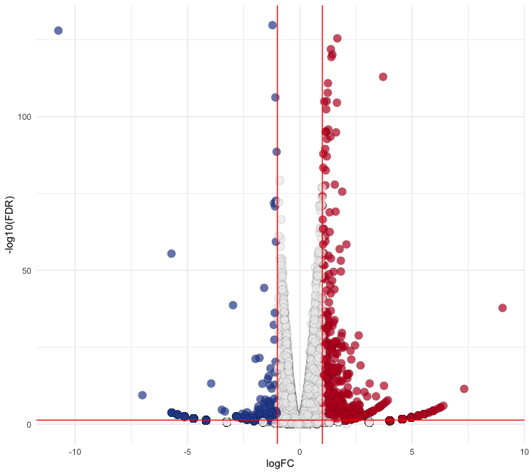
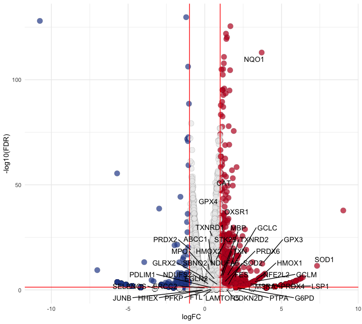
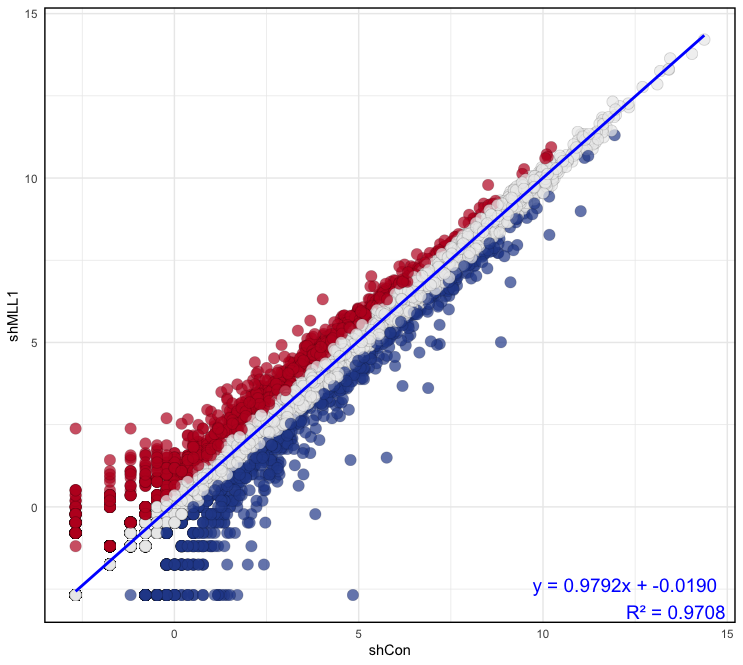

© 2022 Janghyun Choi<br>This work is licensed under a [Creative Commons Attribution-NonCommercial-ShareAlike 4.0 International License](https://creativecommons.org/licenses/by-nc-sa/4.0/).<br> [](http://creativecommons.org/licenses/by-nc-sa/4.0/)

### Important Notice
The dataset used in this section comprises biological replicate samples of human keratinocytes (HaCaT) and their derived knockdown cell lines. The cell lines were categorized into two groups, before and after hydrogen peroxide (H2O2) treatment, and were used as independent variables. All RNA-seq data processing was conducted according to the instructions described in this protocol. Portions of the data have been published in the following papers and deposited in the GEO database under the following accession numbers.
- **Paper**: **Choi, J.**, & Lee, H. (2024). **MLL1 histone methyltransferase and UTX histone demethylase functionally cooperate to regulate the expression of NRF2 in response to ROS-induced oxidative stress**. *Free Radical Biology and Medicine*, 217, 48-59. [DOI](https://doi.org/10.1016/j.freeradbiomed.2024.03.018)
- **GEO accession**: [GSE250127](https://www.ncbi.nlm.nih.gov/geo/query/acc.cgi?acc=GSE250127) 

# Visualizing Differentially Expressed Genes: Volcano Plot and CPM Scatter Plot

Visual representation of differential expression analysis results is crucial for interpreting and communicating findings in RNA-seq experiments. Two common and highly informative plots used in this context are the volcano plot and the CPM (Counts Per Million) scatter plot. These visualizations provide intuitive insights into the data, highlighting genes that are significantly differentially expressed and their expression levels across conditions. This protocol was developed using a system equipped with an Intel 10th generation i9-10910 processor and 48GB of memory. The test environment includes **R version 4.4.0 running on macOS 14.4.1**.

**Required Packages:**
```R
library(ggplot2) 
library(ggrepel)
library(egg)
```

## Volcano Plot
A volcano plot combines statistical significance with the magnitude of change (fold change) in a single plot, making it a powerful tool for identifying DEGs. It plots the negative log10 adjust p-value or false discovery rate (FDR) against the log2 fold change, allowing for easy identification of genes that are both statistically significant and biologically meaningful.

### Step-by-Step Guide
1. **Load Your DEG Data as Base Type:**
- Load the DEG data from a CSV (can be used a txt file) file into a data frame. Ensure that the first row contains headers and the first column contains row names.
  ```R
  Ctr <- read.csv("Volcano.csv", head = T, row.names = 1)
  ```
- The DEG data can be utilized directly for analysis. In this instance, ROS marker genes are identified (`ROS.hallmark`) and labeled (`ROS`) separately. Example of the first few rows of the data:
  ```
  > head(Ctr)
                  SYMBOL    logFC      logCPM   PValue      FDR ROS.hallmark
  ENSG00000204472    AIF1 9.025174  1.58214476 2.34e-40 1.62e-38             
  ENSG00000142168    SOD1 7.315282 -0.07862934 3.15e-13 3.49e-12          ROS
  ENSG00000268651  CTAG1A 6.390608  0.43013880 1.64e-07 1.06e-06             
  ENSG00000170417 TMEM182 6.254823  0.32867916 6.20e-07 3.72e-06             
  ENSG00000214960   CRPPA 6.254823  0.37677955 6.20e-07 3.72e-06             
  ENSG00000164675    IQUB 6.104918 -0.43713437 2.35e-06 1.32e-05 
  ```

2. **Draw a Basal Plot**
- Use ggplot2 to create the basl Volcano plot:
  ```R
  ggplot(data = Ctr, aes(x = logFC, y = FDR)) + geom_point()
  ```

3. **Adjust the y-axis to Display in Negative log10 FDR Format and Add Guide Lines**
- Update the plot to transform the y-axis and add guide lines:
  ```R
  p <- ggplot(data = Ctr, aes(x = logFC, y = -log10(FDR))) + geom_point() + theme_minimal()
  p2 <- p + geom_vline(xintercept=c(-1, 1), col = "red") + geom_hline(yintercept = -log10(0.05), col = "red") 
  ```

4. **Seperate the Section of Significance by Appying FC and FDR**
- Update the plot to distinguish the section of significant DEGs by appying FC and FDR:
  ```R
  # Filter data
  Ctr$diffexpressed <- "NO"
  Ctr$diffexpressed[Ctr$logFC > 1 & Ctr$PValue < 0.05] <- "UP"
  Ctr$diffexpressed[Ctr$logFC < -1 & Ctr$PValue < 0.05] <- "DOWN"

  # Plotting
  p <- ggplot(data = Ctr, aes(x = logFC, y = -log10(FDR))) +
    geom_point(aes(color = diffexpressed), 
              size = 4, 
              shape = 21, 
              fill = c("#294A99", "#ECECEC", "#BE1826")[factor(Ctr$diffexpressed)], 
              alpha = 0.7, 
              stroke = 0.1) +
    scale_color_manual(values = c("DOWN" = "black", "UP" = "black", "NO" = "black")) +
    theme_minimal() +
    theme(legend.position = "none") +
    geom_vline(xintercept = c(-1, 1), col = "red") +
    geom_hline(yintercept = -log10(0.05), col = "red")
  ```
- In these codes, you can adjust the size (`size`), shape (`shape`), transparency (`alpha`), and stroke (`stroke`) of the points to fit your preferences. The `fill` parameter allows you to specify colors for `"DOWN"`, `"NO"`, and `"UP"` states using `hex` codes. Refer to the ggplot2 documentation for more detailed information.

- **Output:**
  <div style="text-align: center; margin: 0;">
      
  </div>

5. **Represent Gene Names that Satisfy Specific Conditions Using `ggrepel`**
- In this case, I found ROS-related genes in papers and databases and labeled them as `ROS` in the `ROS.hallmark` column. Replace the values in this column with the corresponding values in the `SYMBOL` column for plotting:

  ```R
  p2 <- p + 
    geom_text_repel(
      data = subset(Ctr, ROS.hallmark == "ROS"), 
      aes(label = SYMBOL),
      box.padding = 0.35, 
      point.padding = 0.3,
      max.overlaps = Inf,
      segment.color = 'black'
    )
  ```
- To display only genes that meet specific criteria (e.g. DEGs), filter the data accordingly:
  ```R
  # Filter data
  filtered_data <- subset(Ctr, ROS.hallmark == "ROS" & (logFC >= 1 | logFC <= -1) & FDR < 0.05)

  # Plotting
  p2 <- p + 
    geom_text_repel(
      data = filtered_data, 
      aes(label = SYMBOL),
      box.padding = 0.35, 
      point.padding = 0.3,
      max.overlaps = Inf,
      segment.color = 'black'
    )
  ```

- **Output:**
  <div style="text-align: center; margin: 0;">
      
  </div>

### Summarize
```R
Ctr <- read.csv("Volcano.csv", head = T, row.names = 1)
filtered_data <- subset(Ctr, ROS.hallmark == "ROS" & (logFC >= 1 | logFC <= -1) & FDR < 0.05)
p <- ggplot(data = Ctr, aes(x = logFC, y = -log10(FDR))) +
  geom_point(aes(color = diffexpressed), size = 4, shape = 21, 
             fill = c("#294A99", "#ECECEC", "#BE1826")[factor(Ctr$diffexpressed)], 
             alpha = 0.7, stroke = 0.1) +
  scale_color_manual(values = c("DOWN" = "black", "UP" = "black", "NO" = "black")) +
  theme_minimal() +
  theme(legend.position = "none",
        panel.border = element_rect(color = "black", fill = NA, size = 1)) +
  geom_vline(xintercept = c(-1, 1), col = "red") +
  geom_hline(yintercept = -log10(0.05), col = "red") +
  geom_text_repel(
    data = filtered_data, 
    aes(label = SYMBOL),
    box.padding = 0.35, 
    point.padding = 0.3,
    max.overlaps = Inf,
    segment.color = 'black',
    size = 3  
  )

# Adjust plot size for publication
p2 <- set_panel_size(p, width = unit(49, "mm"), height = unit(49, "mm"))
grid.arrange(p2)
```

## CPM Scatter Plot
The CPM scatter plot is used to visualize the normalized expression levels of genes between two conditions. By plotting the log-transformed CPM values of one condition against another, this scatter plot highlights the overall distribution and correlation of gene expression levels, helping to identify outliers and trends.

### Step-by-Step Guide
1. **Load Your CPM Data as Base Type**
  - Load the CPM data from a CSV file into a data frame. Ensure that the first row contains headers and the first column contains row names:
  ```R
  Ctr <- read.csv("Scatter_CPM.csv", head = T, row.names = 1)
  ```
- Example of the first few rows of the data:
  ```
  > head(Ctr)
                      shCon    shMLL1    shNRF2     shUTX
  ENSG00000000003 -2.680285 -2.680285 -2.680285 -1.549635
  ENSG00000000005  4.307581  4.677028  4.580042  4.872485
  ENSG00000000419 -1.749770 -1.753980 -1.171245 -1.549635
  ENSG00000000460  5.275807  5.093826  5.081307  4.986667
  ENSG00000000938  3.287921  3.437214  4.075670  3.266172
  ENSG00000000971  5.988133  4.288445  5.394514  4.854088
  ```

2. **Caculate Correlation Coefficiency Between Samples**
- Calculate the linear model to assess the relationship between two samples. This can help determine how similar the expression levels are between two conditions:
  ```R
  # Fit a lineat model
  model <- lm(formula = shCon ~ shMLL1, data = Ctr)

  # Summarize the model to get the correlation coefficient
  model_summary <- summary(model)

  # Extract coefficiency
  intercept <- model$coefficients[1]
  slope <- model$coefficients[2]
  r_squared <- model_summary$r.squared
  ```
- **Output:**
  ```
  > model <- lm(formula = shCon ~ shMLL1, data = Ctr)
  > model
  Call:
  lm(formula = shCon ~ shMLL1, data = Ctr)

  Coefficients:
  (Intercept)       shMLL1  
    -0.01902      0.97918  
  ```
  ```
  > model_summary <- summary(model)
  > model_summary
  Call:
  lm(formula = shCon ~ shMLL1, data = Ctr)

  Residuals:
      Min      1Q  Median      3Q     Max 
  -4.9938 -0.2207 -0.0368  0.2283  7.4868 

  Coefficients:
              Estimate Std. Error t value Pr(>|t|)    
  (Intercept) -0.019021   0.007697  -2.471   0.0135 *  
  shMLL1       0.979179   0.001696 577.328   <2e-16 ***
  ---
  Signif. codes:  0 ‘***’ 0.001 ‘**’ 0.01 ‘*’ 0.05 ‘.’ 0.1 ‘ ’ 1

  Residual standard error: 0.6539 on 10026 degrees of freedom
  Multiple R-squared:  0.9708,	Adjusted R-squared:  0.9708 
  F-statistic: 3.333e+05 on 1 and 10026 DF,  p-value: < 2.2e-16
  ```

3. **Make a scatter plot**
- In this section, you will create a scatter plot to visualize the relationship between two conditions (`shCon` and `shMLL1`) and classify genes based on their expression changes:
  ```R
  # Calculate difference between samples
  classify <- (Ctr$shMLL1) - (Ctr$shCon)

  # Classify genes
  Ctr$diffexpressed <- "NO"
  Ctr$diffexpressed[classify > 0.5] <- "UP"
  Ctr$diffexpressed[classify < (-0.5)] <- "DOWN"

  # Depict a plot with the linear model
  p <- ggplot(data = Ctr, aes(x = shCon, y = shMLL1)) +
    geom_point(aes(color = diffexpressed), size = 4, shape = 21, 
              fill = c("#294A99", "#ECECEC", "#BE1826")[factor(Ctr$diffexpressed)], 
              alpha = 0.7, stroke = 0.1) +
    scale_color_manual(values = c("DOWN" = "black", "UP" = "black", "NO" = "black")) +
    theme_minimal() +
    theme(legend.position = "none",
          panel.border = element_rect(color = "black", fill = NA, size = 1)) +
    geom_smooth(method = "lm", se = FALSE, color = "blue") +  
    annotate("text", x = Inf, y = -Inf, label = sprintf("y = %.4fx + %.4f\nR² = %.4f", slope, intercept, r_squared),
            hjust = 1.1, vjust = -0.1, size = 5, color = "blue")
  ```

- **Output:**
  <div style="text-align: center; margin: 0;">
      
  </div>

### Summarize
```R
Ctr <- read.csv("Scatter_CPM.csv", head = T, row.names = 1)
model <- lm(formula = shCon ~ shMLL1, data = Ctr)
model_summary <- summary(model)
intercept <- model$coefficients[1]
slope <- model$coefficients[2]
r_squared <- model_summary$r.squared

p <- ggplot(data = Ctr, aes(x = shCon, y = shMLL1)) +
  geom_point(aes(color = diffexpressed), size = 4, shape = 21, 
            fill = c("#294A99", "#ECECEC", "#BE1826")[factor(Ctr$diffexpressed)], 
            alpha = 0.7, stroke = 0.1) +
  scale_color_manual(values = c("DOWN" = "black", "UP" = "black", "NO" = "black")) +
  theme_minimal() +
  theme(legend.position = "none",
        panel.border = element_rect(color = "black", fill = NA, size = 1)) +
  geom_smooth(method = "lm", se = FALSE, color = "blue") +  
  annotate("text", x = Inf, y = -Inf, label = sprintf("y = %.4fx + %.4f\nR² = %.4f", slope, intercept, r_squared),
          hjust = 1.1, vjust = -0.1, size = 5, color = "blue")

# Adjust plot size for publication
p2 <- set_panel_size(p, width = unit(49, "mm"), height = unit(49, "mm"))
grid.arrange(p2)
```

# Citation
- R
**R Core Team, R**. (2013). **R: A language and environment for statistical computing**. [HTML](https://apps.dtic.mil/sti/citations/AD1039033)

- ggplot2
**Wilkinson, L.** (2011). **ggplot2: elegant graphics for data analysis by WICKHAM, H**. [DOI](https://doi.org/10.1111/j.1541-0420.2011.01616.x)
