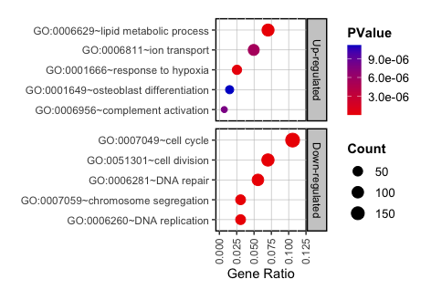
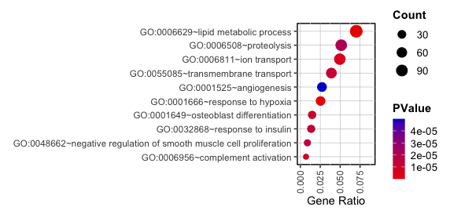
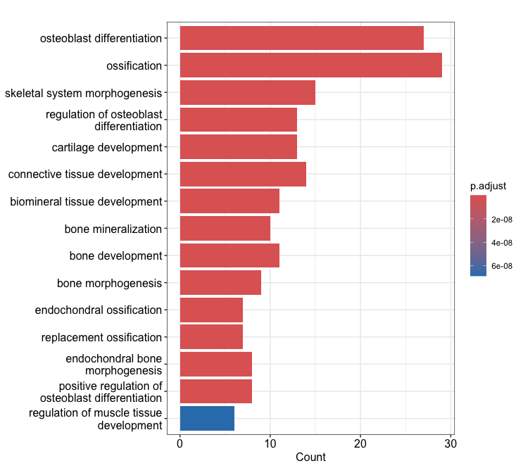
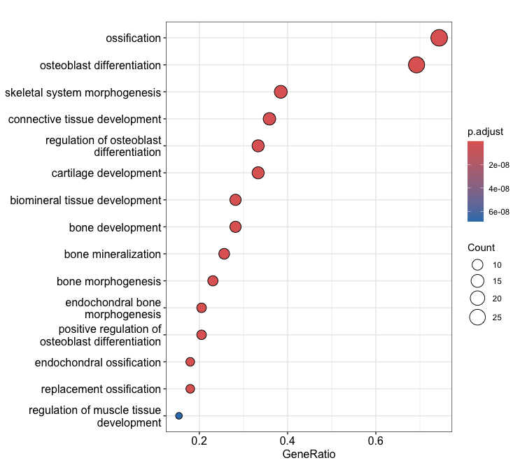
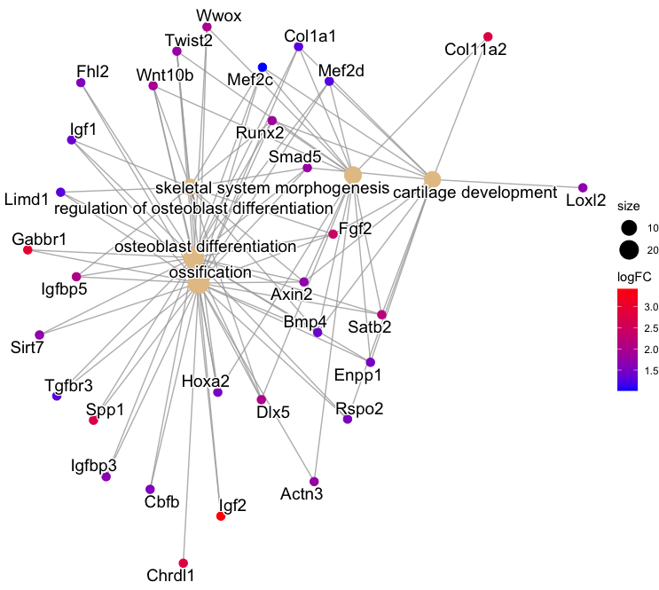
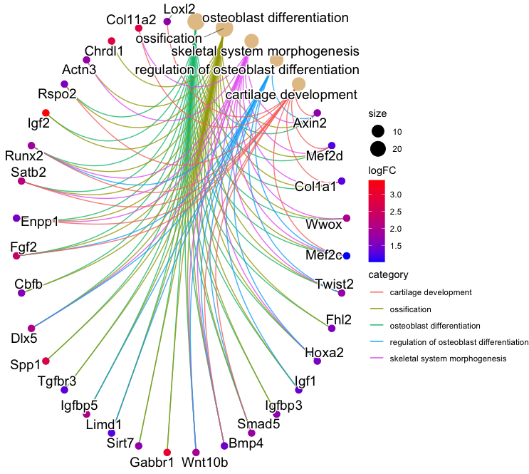
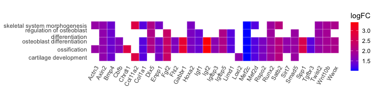
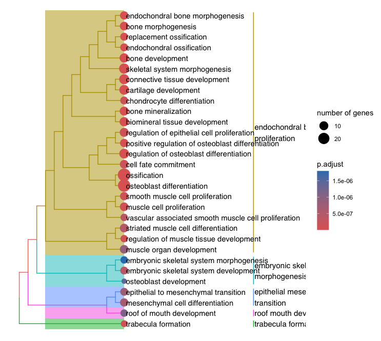
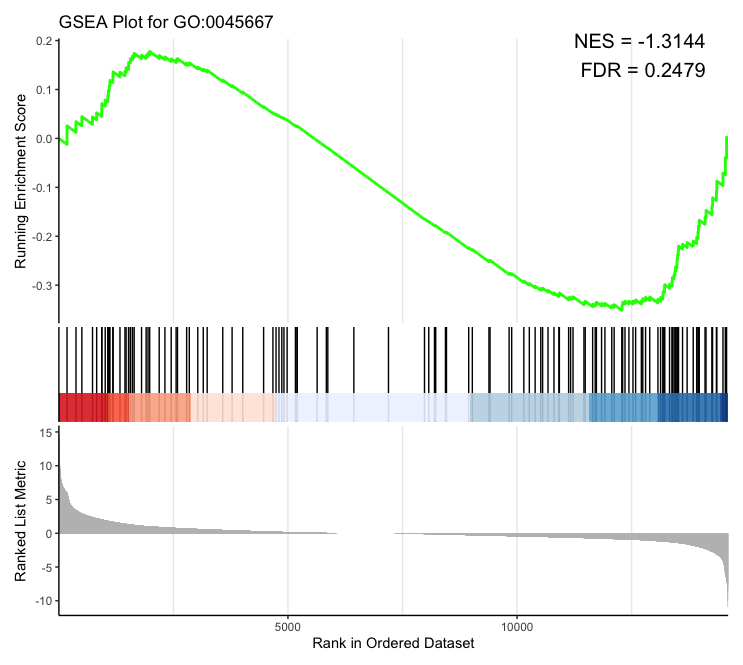

© 2022 Janghyun Choi<br>This work is licensed under a [Creative Commons Attribution-NonCommercial-ShareAlike 4.0 International License](https://creativecommons.org/licenses/by-nc-sa/4.0/).<br> [](http://creativecommons.org/licenses/by-nc-sa/4.0/)

# Understanding Gene Functions: An Overview of Gene Ontology and KEGG Pathway Analysis
Gene Ontology (GO) and KEGG Pathway analysis are essential bioinformatics tools for understanding gene functions and their roles within biological systems. GO provides a structured framework for classifying gene functions across different species, organizing them into three main categories: Biological Process, Molecular Function, and Cellular Component. This classification helps researchers comprehend the biological context and interactions of genes. On the other hand, KEGG Pathway analysis maps genes to known biological pathways, allowing scientists to visualize and interpret complex biochemical processes and molecular interactions within the cell. Together, these tools facilitate a deeper understanding of gene functions and their contributions to various biological phenomena. This protocol was developed using a system equipped with an Intel 10th generation i9-10910 processor and 48GB of memory. The test environment includes **R version 4.4.0 running on macOS 14.4.1**.

Currently, GO/KEGG analysis is generally categorized into web-based and terminal-based formats. In this section, I will elaborate on the functional analysis of genes using the widely-used web-based tool, DAVID, as well as the terminal-based tools, enrichGO and enrichKEGG, which are part of the clusterProfile R package.

## Web-based Tool: DAVID 
DAVID (Database for Annotation, Visualization, and Integrated Discovery) is a comprehensive web-based tool that offers functional annotation tools for interpreting the biological significance of large gene lists. Integrates multiple annotation resources, including GO and KEGG, for functional annotation, gene ontology enrichment, pathway mapping, and visualization.

| Advantage | Disadvantage |
| ----- | ----- |
|  - User-friendly interface with integrated resources. <br> - Allows easy upload of gene lists and quick retrieval of functional annotations. <br> - Provides a variety of visualization tools to aid interpretation.| - Limited customization options compared to command-line tools. <br> - Dependent on internet access and server availability. <br> - Can be slower with very large datasets. |

### Step-by-Step DAVID Guide

1. Go to the [DAVID website](https://david.ncifcrf.gov/).
2. Click **Start Analysis** on the website.
3. Paste your gene list in the step 1 box.
    - In this example, I selected 1962 upragulated DEGs included by osteogenic stimuli and uploaded them. These genes designated as Ensembl IDs rather than gene symbols.
4. Select identifier.
    - Choose your gene type. In this example, I selected "ENSEMBL_GENE_ID".
    - Note that Ensembl IDs have different prefixes for different species, so specifying a species is not necessary, but some identifiers may require it.
5. Select the list type as either **gene list** or 'background'.
    - **Gene List**: This is the primary list of genes you are interested in analyzing. It is the focus of your enrichment analysis.
    - Background (Optional): This is an optional list used to define the background set of genes against which your gene list is compared. If not provided, DAVID uses a default background set based on the genome of the organism.
6. Click **Submit List**.
7. Check the **Gene List Manager** in the left panel. 
    - The number of genes that DAVID recognized and those it did not (Unknown) will appear. If there are many unknown genes, consider re-uploading using a conversion tool or another identifier.
8. Click **Functional Annotation Tool** in the center panel.
9. DAVID will display the **Annotation Summary Results**. 
10. Use the **Gene Ontology** section and the **Pathway** section in the results to explore the functional annotation and enrichment of your gene list.
    - All data is available for download as tab-delimited text.
    
### Understanding Gene Ontology section
In DAVID functional annotation results, when you click on the GO section, you encounter several subsections labeled as **BP (Biological Process)**, **MF (Molecular Function)**, **CC (Cellular Component)**, followed by labels such as `_1` to `_5`, `ALL`, and `DIRECT`. Here is what each of these terms signifies:
1) **BP (Biological Process)**: This section pertains to biological objectives or roles completed by sets of molecular activities. Examples include cellular processes and metabolic functions. 

2) **MF (Molecular Function)**: This section describes the biochemical activity of genes, such as binding or catalysis, independent of the gene products (e.g., protein) performing them. 

3) **CC (Cellular Component)**: This part describes where gene products are located in the cell, such as membranes or organelles. 

4) **ALL**: This category provides a consolidated view of the results across all three GO domains (BP, MF, CC), offering a comprehensive overview without the segregation into specific domains.

5) **DIRECT**: This indicates the annotation derived directly from the primary literature and not inferred from other sources or computational predictions. It is typically more specific and can be considered more reliable as it is directly tied to experimental evidence.

Lower numbers (like `_1` or `_2`) generally indicate groups of GO terms that are more general and broadly applicable to a variety of biological contexts. As the numbers increase (towards `_3`, `_4`, and `_5`), the GO terms become more specific and detailed. These higher numbers represent more niche and precise annotations that are closely related to the specific functions or locations of the genes in your list. 

### Understanding GO/KEGG Analysis Output
- Open GO result with R:
    ```
    > GO_DAVID <- read.table("Up_GO.txt", sep = "\t", header = TRUE)
    > GO_DAVID
            Category                                  Term Count   Percent       PValue              Genes ListTotal PopHits
    1 GOTERM_BP_DIRECT    GO:0006629~lipid metabolic process   119 6.0994362 6.263319e-12 ENSMUSG00000025350      1695     741
    2 GOTERM_BP_DIRECT        GO:0001666~response to hypoxia    43 2.2039979 1.888764e-07 ENSMUSG00000034205      1695     215
    3 GOTERM_BP_DIRECT              GO:0006811~ion transport    84 4.3054844 5.390971e-06 ENSMUSG00000031075      1695     605
    4 GOTERM_BP_DIRECT      GO:0006956~complement activation    12 0.6150692 7.838427e-06 ENSMUSG00000022018      1695      28
    5 GOTERM_BP_DIRECT GO:0001649~osteoblast differentiation    25 1.2813942 1.118882e-05 ENSMUSG00000008136      1695     110
    PopTotal FoldEnrichment   Bonferroni    Benjamini          FDR
    1    20199       1.913766 3.367162e-08 3.367160e-08 3.352128e-08
    2    20199       2.383363 1.014884e-03 5.076997e-04 5.054332e-04
    3    20199       1.654566 2.856599e-02 9.660621e-03 9.617493e-03
    4    20199       5.107206 4.126402e-02 9.976222e-03 9.931685e-03
    5    20199       2.708367 5.837805e-02 9.976222e-03 9.931685e-03
    ```
- Open KEGG result with R:
    ```
    > KEGG_DAVID <- read.table("Up_KEGG.txt", sep = "\t", header = TRUE)
    > KEGG_DAVID
        Category                                                       Term Count   Percent       PValue
    1 KEGG_PATHWAY                                mmu01100:Metabolic pathways   214 10.968734 3.927550e-11
    2 KEGG_PATHWAY                 mmu00982:Drug metabolism - cytochrome P450    21  1.076371 1.615860e-06
    3 KEGG_PATHWAY            mmu00760:Nicotinate and nicotinamide metabolism    13  0.666325 1.704787e-04
    4 KEGG_PATHWAY mmu05208:Chemical carcinogenesis - reactive oxygen species    37  1.896463 2.304140e-04
    5 KEGG_PATHWAY                             mmu04014:Ras signaling pathway    36  1.845208 1.168008e-03
                    Genes ListTotal PopHits PopTotal FoldEnrichment   Bonferroni    Benjamini          FDR
    1 ENSMUSG00000031231827      1625    9463     9463       1.506898 1.327511e-08 1.327512e-08 1.284309e-08
    2    ENSMUSG00000074183       827      71     9463       3.384420 5.460121e-04 2.730804e-04 2.641932e-04
    3    ENSMUSG00000115338       827      42     9463       3.541746 5.599775e-02 1.920727e-02 1.858218e-02
    4    ENSMUSG00000074183       827     224     9463       1.890066 7.493281e-02 1.946998e-02 1.883635e-02
    5    ENSMUSG00000031453       827     235     9463       1.752903 3.263318e-01 6.597445e-02 6.382735e-02
    ```
When interpreting the results of a GO or KEGG analysis, several key metrics are presented:
1) **Count**: This metric indicates the number of genes associated with a particular GO and KEGG term within the list of genes being analyzed.

2) **List Total**: Represents the total number of genes analyzed. This value serves as the denominator for calculating proportions of genes associated with specific GO/KEGG terms.

3) **Pop Hits**: Refers to the number of genes associated with the same GO term in the reference gene set, which typically includes all genes in the organism’s genome. 

4) **Pop Total**: The total number of genes in the reference gene set. This number is used to normalize the data and helps in calculating how representative the term is in the context of the entire genome.

5) **Fold Enrichment**: This is a crucial statistic that indicates how much more often genes associated with a particular GO term are observed in the list of analyzed genes compared to what would be expected based on their representation in the genome. 

### Alternative Web-based Tool: Gene Ontology Resource
The Gene Ontology Resource provides web-based tools for exploring GO annotations and performing enrichment analysis. This tools offers access to extensive GO annotations, tools for functional profiling, and interfaces for browsing and searching GO terms. **Go to the [Gene Ontology Resource](https://geneontology.org).**

| Advantage | Disadvantage |
| ----- | ----- |
| - User-friendly and accessible without needing programming skills. <br> - Comprehensive and detailed GO term information. <br> - Regularly updated with the latest GO terms and annotations.| - Limited to GO analysis without extensive pathway mapping like KEGG. <br> - Customization and advanced analysis options are less flexible than in command-line tools. <br> - Relies on internet access and web interface performance. |

## Depicting a Bubble Chart from GO/KEGG Analysis Results
A bubble chart is an exceptionally effective visual tool for presenting the results of GO and KEGG analyses. This type of chart enhances the visualization of the significance and impact of gene sets across different biological processes, molecular functions, and cellular components. In a bubble chart:

- **Each bubble represents a specific GO/KEGG term**, providing a direct visual correlation to the biological aspect being analyzed.
- **The size of the bubble** is determined by the number of genes associated with each GO/KEGG term, visually emphasizing terms with a greater gene count.
- **The color of each bubble** varies according to the statistical significance (e.g., p-value), offering an immediate sense of the term relevance and the robustness of the associated data.

In this section, I will construct a bubble chart using `ggplot2` to display the GO analysis results. The y-axis will list the GO terms, while the x-axis will represent the gene ratio, indicating the proportion of genes linked to each GO term relative to the total number of genes analyzed. The size of each bubble will be proportional to the gene count associated with each term, and the color of bubble will reflect the statistical significance, providing a comprehensive and intuitive visual summary of the data.

**Required Packages:**
```R
library(ggplot2) 
library(dplyr)
library(gridExtra)
library(egg)
library(readxl)
```

### Step-by-Step Guide for Depicting Bubble Chart with Multiple Facets

1. **Data Preparation**
- Import the Gene Ontology results from text files into R, ensuring that the files have headers in the first row and do not contain row names. This example uses data from a GO analysis of genes upregulated and downregulated by differentiation stimuli in normal mesenchymal stem cells:
    ```R
    UP <- read.table("upDEG.txt", sep = "\t", header = TRUE)
    DOWN <- read.table("downDEG.txt", sep = "\t", header = TRUE)
    ```
- Next, select the five GO terms with the lowest False Discovery Rate (FDR). **Note** that selecting the top 5-10 terms based on FDR is a common practice but not a strict rule. **Researchers are encouraged to tailor the selection criteria based on the specific narrative and needs of their study.**
    ```R
    top_up <- UP %>% 
        arrange(FDR) %>% 
        slice_head(n = 5) %>% 
        mutate(Type = "Up-regulated")

    top_down <- DOWN %>% 
        arrange(FDR) %>% 
        slice_head(n = 5) %>% 
        mutate(Type = "Down-regulated")
    ```

- Combine the top GO terms from both datasets into a single object and compute the `Ratio` of `Count` to `List.Total` for each term:
    ```R
    combined <- bind_rows(top_up, top_down)
    data <- combined %>%
        mutate(Ratio = Count / List.Total)
    ```
    ```
    > data
            Category                                  Term Count        X.       PValue List.Total Pop.Hits Pop.Total
    1  GOTERM_BP_DIRECT    GO:0006629~lipid metabolic process   119 6.0994362 6.263319e-12       1695      741     20199
    2  GOTERM_BP_DIRECT        GO:0001666~response to hypoxia    43 2.2039979 1.888764e-07       1695      215     20199
    3  GOTERM_BP_DIRECT              GO:0006811~ion transport    84 4.3054844 5.390971e-06       1695      605     20199
    4  GOTERM_BP_DIRECT      GO:0006956~complement activation    12 0.6150692 7.838427e-06       1695       28     20199
    5  GOTERM_BP_DIRECT GO:0001649~osteoblast differentiation    25 1.2813942 1.118882e-05       1695      110     20199
    6  GOTERM_BP_DIRECT                 GO:0007049~cell cycle   190 9.8752599 9.081317e-52       1798      649     20199
    7  GOTERM_BP_DIRECT              GO:0051301~cell division   126 6.5488565 2.885314e-37       1798      404     20199
    8  GOTERM_BP_DIRECT     GO:0007059~chromosome segregation    55 2.8586279 9.352744e-28       1798      111     20199
    9  GOTERM_BP_DIRECT            GO:0006260~DNA replication    55 2.8586279 7.029347e-26       1798      119     20199
    10 GOTERM_BP_DIRECT                 GO:0006281~DNA repair   100 5.1975052 5.008471e-22       1798      395     20199
    Fold.Enrichment   Bonferroni    Benjamini          FDR           Type       Ratio
    1         1.913766 3.367162e-08 3.367160e-08 3.352128e-08   Up-regulated 0.070206490
    2         2.383363 1.014884e-03 5.076997e-04 5.054332e-04   Up-regulated 0.025368732
    3         1.654566 2.856599e-02 9.660621e-03 9.617493e-03   Up-regulated 0.049557522
    4         5.107206 4.126402e-02 9.976222e-03 9.931685e-03   Up-regulated 0.007079646
    5         2.708367 5.837805e-02 9.976222e-03 9.931685e-03   Up-regulated 0.014749263
    6         3.288888 5.278062e-48 5.278062e-48 5.175443e-48 Down-regulated 0.105672970
    7         3.503720 1.676944e-33 8.384722e-34 8.221701e-34 Down-regulated 0.070077864
    8         5.566470 5.435815e-24 1.811938e-24 1.776710e-24 Down-regulated 0.030589544
    9         5.192254 4.085457e-22 1.021364e-22 1.001506e-22 Down-regulated 0.030589544
    10        2.844088 2.910923e-18 5.821847e-19 5.708655e-19 Down-regulated 0.055617353
    ```
    *In this example, the 'Genes' column was excessively lengthy and has been remove to `NULL` to streamline the dataset.*
<br>
- When working with data not originating directly from `txt` files, such as arbitrarily selected GO terms for specific analyses, using Excel can be advantageous. Pre-calculate `Type` and `Ratio` in Excel using its functions. This preparation makes the data ready for immediate plotting upon import into R.
    ```R
    data <- read_excel("PlotGO.xlsx", sheet = "DOWN_Facet") 
    ```

2. **Plotting**
- Draw a Basal Plot:
  ```R
    S1 <- ggplot(data, aes(x = Ratio, y = reorder(Term, Ratio), size = Count, color = PValue)) +
    geom_point(alpha = 1) +
    facet_grid(factor(Type, levels = c("Up-regulated", "Down-regulated")) ~ ., scales = "free") +
    labs(x = "Gene Ratio", y = "") +
    theme(panel.background = element_rect(fill = 'white', 
                                            color = 'black', 
                                            linetype = 'solid', 
                                            size = 1),
            panel.grid.major = element_line(color = "grey", 
                                            size = 0.2),
            strip.background = element_rect(fill = "grey80", 
                                            color = "black", 
                                            size = 1, 
                                            linetype = 'solid'),
            strip.text = element_text(color = "black"),
            legend.key = element_blank(),  
            legend.text = element_text(size = 10),  
            legend.title = element_text(face = "bold"), 
            axis.text.x = element_text(angle = 90, vjust = 0.5, hjust = 1)) +
    guides(color = guide_colourbar(barwidth = 0.8, barheight = 4))
  ```

- Change graphical components:
    ```R
    # Color space
    S1 = S1 + scale_color_gradient(low = "red2",  high = "mediumblue", space = "Lab")

    # Buble size range can be variable as follow:
    S2 <- S1+scale_size(range = c(2, 5))

    # Adjust the x-axis
    S3 <- S2 + xlim(0, 0.12)

    # Adjust chart size for publication, 26.5/25 (width) and 30/33/40 (height) combination
    S4 <- set_panel_size(S3, width = unit(26.5, "mm"), height = unit(30, "mm")) 
    grid.arrange(S4)
    ```

- **Output:**
  <div style="text-align: center; margin: 0;">
      
  </div>

<!DOCTYPE html>
<html lang="en">
<head>
    <meta charset="UTF-8">
    <meta name="viewport" content="width=device-width, initial-scale=1.0">
    <title>Typing Area</title>
    <style>
        .indented-container {
            margin-left: 20px; 
        }
        .indented-container textarea {
            width: calc(100% - 20px);
            box-sizing: border-box;
            font-family: Consolas, "Courier New", monospace;
            font-size: 1em;
        }
        .indented-container p {
            font-weight: bold;
            margin-bottom: 5px;
        }
    </style>
</head>
<body>
    <div class="indented-container">
        <p>Code Memo Area:</p>
        <textarea rows="10"></textarea>
    </div>
</body>
</html>


### Step-by-Step Guide for Depicting Bubble Chart with a Single Column

1. **Data Preparation**
- Import the Gene Ontology results from text files into R. This example uses data from a GO analysis of genes upregulated by differentiation stimuli in normal mesenchymal stem cells:
    ```R
    UP <- read.table("upDEG.txt", sep = "\t", header = TRUE)
    ```
- Next, select the 10 GO terms with the lowest FDR. **Once again, selecting 10 GO terms as FDR criteria is not mandatory.** Then, calculate the 'Ratio' of 'Count' to 'List.Total'.
    ```R
    top_up <- UP %>% 
        arrange(FDR) %>% 
        slice_head(n = 10)
    
    data <- top_up %>%
        mutate(Ratio = Count / List.Total)
    ```

2. **Plotting**
- Draw a Basal Plot:
  ```R
    S1 <- ggplot(data, aes(x = Ratio, y = reorder(Term, Ratio), size = Count, color = PValue)) +
    geom_point(alpha = 1) +
    labs(x = "Gene Ratio", y = "") +
    theme(panel.background = element_rect(fill = 'white', 
                                            color = 'black', 
                                            linetype = 'solid', 
                                            size = 1),
            panel.grid.major = element_line(color = "grey", 
                                            size = 0.2),
            strip.text = element_text(color = "black"),
            legend.key = element_blank(),  
            legend.text = element_text(size = 10),  
            legend.title = element_text(face = "bold"), 
            axis.text.x = element_text(angle = 90, vjust = 0.5, hjust = 1)) +
    guides(color = guide_colourbar(barwidth = 0.8, barheight = 4))
  ```

- Change graphical components:
    ```R
    # Color space
    S1 = S1 + scale_color_gradient(low = "red2",  high = "mediumblue", space = "Lab")

    # Buble size range can be variable as follow:
    S2 <- S1+scale_size(range = c(2, 5))

    # Adjust the x-axis
    S3 <- S2 + xlim(0, 0.09)

    # Adjust chart size for publication
    S4 <- set_panel_size(S3, width = unit(26.5, "mm"), height = unit(48, "mm")) 
    grid.arrange(S4)
    ```
- **Output:**
  <div style="text-align: center; margin: 0;">
      
  </div>

<!DOCTYPE html>
<html lang="en">
<head>
    <meta charset="UTF-8">
    <meta name="viewport" content="width=device-width, initial-scale=1.0">
    <title>Typing Area</title>
    <style>
        .indented-container {
            margin-left: 20px; 
        }
        .indented-container textarea {
            width: calc(100% - 20px);
            box-sizing: border-box;
            font-family: Consolas, "Courier New", monospace;
            font-size: 1em;
        }
        .indented-container p {
            font-weight: bold;
            margin-bottom: 5px;
        }
    </style>
</head>
<body>
    <div class="indented-container">
        <p>Code Memo Area:</p>
        <textarea rows="10"></textarea>
    </div>
</body>
</html>

## Terminal-based GO Tools: enrichGO and enrichKEGG 
The enrichGO and enrichKEGG are powerful R package part of the `clusterProfiler` suite, designed for the functional annotation and enrichment analysis of gene lists. They provide robust tools for GO and pathway enrichment analyses, allowing researchers to interpret the biological significance of large gene sets through comprehensive statistical analyses.

| Advantage | Disadvantage |
| ----- | ----- |
| - High level of customization and flexibility. <br> - Capable of handling large datasets efficiently. <br> - Integrates well with other R packages for further analysis and visualization. <br> - Provides reproducible results as part of R scripts or workflows.| - Requires knowledge of R and command-line operations. <br> - Steeper learning curve for users unfamiliar with programming. <br> - Lack of a graphical user interface, which may be less intuitive for some users. |

**Required Packages:**
```R
library(clusterProfiler)
library(org.Mm.eg.db) # Organism-specific genome data package, refer to bellow.
library(dplyr)
library(enrichplot)
library(ggplot2) 
library(gridExtra)
library(egg)
library(readxl)
```

**Choosing the Appropriate Organism Database**
- For organisms other than mouse, you need to use the appropriate organism-specific database. To find the appropriate database for your organism, you can search the Bioconductor website or use the BiocManager package's search functionality:
    ```R
    BiocManager::available("org.")
    ```
    ```
    > BiocManager::available("org.")
    'getOption("repos")' replaces Bioconductor standard repositories, see 'help("repositories", package = "BiocManager")' for
    details.
    Replacement repositories:
        CRAN: http://cran.rstudio.com/
    [1] "AnnotationForge"     "BarBorGradient"      "BSgenomeForge"       "facebookorganicR"    "forge"              
    [6] "IsoCorrectoRGUI"     "KTensorGraphs"       "org.Ag.eg.db"        "org.At.tair.db"      "org.Bt.eg.db"       
    [11] "org.Ce.eg.db"        "org.Cf.eg.db"        "org.Dm.eg.db"        "org.Dr.eg.db"        "org.EcK12.eg.db"    
    [16] "org.EcSakai.eg.db"   "org.Gg.eg.db"        "org.Hs.eg.db"        "org.Mm.eg.db"        "org.Mmu.eg.db"      
    [21] "org.Mxanthus.db"     "org.Pf.plasmo.db"    "org.Pt.eg.db"        "org.Rn.eg.db"        "org.Sc.sgd.db"      
    [26] "org.Ss.eg.db"        "org.Xl.eg.db"        "Organism.dplyr"      "OrganismDbi"         "organizr"           
    [31] "OrgMassSpecR"        "orgR"                "orgutils"            "OscillatorGenerator" "pd.porgene.1.0.st"  
    [36] "pd.porgene.1.1.st"   "PriorGen"            "rNeighborGWAS"       "RNGforGPD"           "sectorgap"          
    ```
- Then you can install the required organism database using Bioconductor:
    ```R
    BiocManager::install("org.*.eg.db") # '*' is organism abb.
    library(org.*.eg.db)
    ```

### Step-by-Step Guide 

1. **Data Preparation**
- Load raw DEG data obtained from `edgeR` or user-modified DEG data into R, ensuring that the files have headers in the first row and do not contain row names. In this section, I will load the raw data of gene list (result of `edgeR`) that change on osteogenic stimuli in mouse stem cells, filtering out only the DEGs that are upregulated:
    ```R
    # Load data
    data <- read.csv("DEG.csv", header = T)

    # Filter data
    UP <- data %>%
        filter(logFC >= 1, FDR < 0.05)
    ```
    ```
    > head(UP)
    Symbol    ensembl_gene_id    logFC     logCPM       PValue          FDR osteoMarker
    1    Tbx2 ENSMUSG00000000093 3.044420  0.1584658 8.460000e-09 1.020000e-07            
    2   Axin2 ENSMUSG00000000142 1.695402 -0.9306477 8.412736e-03 2.965543e-02       Osteo
    3   Itgb2 ENSMUSG00000000290 2.506077  0.8950346 2.250000e-11 3.870000e-10            
    4     Fap ENSMUSG00000000392 2.422669  0.4124939 1.695242e-03 7.284350e-03            
    5 Septin1 ENSMUSG00000000486 1.792568  2.3315912 8.820000e-12 1.600000e-10            
    6  Acvr1b ENSMUSG00000000532 1.094280  5.3096726 3.170000e-07 2.980000e-06            
    ```
- Next, check the resources of the inputs available to enrichGO.
    ```R
    keytypes(org.Mm.eg.db)
    ```
    ```
    > keytypes(org.Mm.eg.db)
    [1] "ACCNUM"       "ALIAS"        "ENSEMBL"      "ENSEMBLPROT"  "ENSEMBLTRANS" "ENTREZID"     "ENZYME"       "EVIDENCE"    
    [9] "EVIDENCEALL"  "GENENAME"     "GENETYPE"     "GO"           "GOALL"        "IPI"          "MGI"          "ONTOLOGY"    
    [17] "ONTOLOGYALL"  "PATH"         "PFAM"         "PMID"         "PROSITE"      "REFSEQ"       "SYMBOL"       "UNIPROT"     
    ```
- In this case, I can use the `Symbol` row and the `ensembl_gene_id` row as input from the `UP` object. This corresponds to `SYMBOL` and `ENSEMBL` in the keytype information (`keytypes(org.Mm.eg.db)`), which means that enrichGO supports both gene symbol and gene ID row as resource keytypes. For this example, I will use `ENSEMBL` as the keytype.

2. **Run enrichGO and enrichKEGG**
- Although a filter has been applied, the example output remains extensive due to the substantial number of genes under analysis. Therefore, in this section, I will focus on filtering only the osteogenic markers among the upregulated DEGs:
    ```R
    data <- read.csv("DEG.csv", header = T)
    Filter_UP <- data %>%
        filter(logFC >= 1, FDR < 0.05, osteoMarker == "Osteo")
    ```
- Run `enrichGO`:
    ```R
    ego <- enrichGO(gene = Filter_UP$ensembl_gene_id,
                    keyType = "ENSEMBL",
                    OrgDb = org.Mm.eg.db,
                    ont = "BP",
                    pAdjustMethod = "fdr",
                    qvalueCutoff = 0.05,
                    readable = TRUE)
    # Save GO results
    write.csv(ego, "GOenrich.csv")  
    ```
    - in these codes,
            - **`gene = Filter_UP$ensembl_gene_id`**: Specifies the list of genes to analyze. In this case, it uses the `ensembl_gene_id` column from the `Filter_UP` dataframe.
            - **`keyType = "ENSEMBL"`**: Defines the type of gene identifier.
            - **`OrgDb = org.Mm.eg.db`**: Specifies the gene annotation database.
            - **`ont = "BP"`**: Specifies the type of GO terms to analyze. Possible terms are `BP`, `MP`, and `CC`.
            - **`pAdjustMethod = "fdr"`**: Defines the method for p-value adjustment. Possible methods are `holm`, `hochberg`, `hommel`**, `bonferroni`, `BH`, `BY`, `fdr`, `none`.
            - **`qvalueCutoff = 0.05`**: Specifies the cutoff for q-value.
            - **`readable = TRUE`**: If set to `TRUE`, converts gene IDs in the results to a more readable form (e.g., gene symbols).
<br>

- Before running `enrichKEGG`, check the KEGG organism code:
    ```R
    search_kegg_organism('Mus musculus', by='scientific_name') # 'Mus musculus' specifies your organism.
    ```
    ```
    > search_kegg_organism('Mus musculus', by='scientific_name')
    kegg_code scientific_name common_name
    30       mmu    Mus musculus house mouse
    ```            
- Run `enrichKEGG`:
    ```R
    ekegg <- enrichKEGG(gene = Filter_UP$ensembl_gene_id,
                        keyType = "ENSEMBL",
                        organism = "mmu", # This value (mmu) can be obtained from above 'search_kegg' code.
                        pAdjustMethod = "fdr",
                        qvalueCutoff = 0.05)

    # Save KEGG results
    write.csv(ekegg, "KEGGenrich.csv")  
    ```

3. **Visualization**
- The `enrichplot` package offers a variety of visualization methods for the GO and KEGG analyses obtained from the `enrichGO` and `enrichKEGG` results. In addition to `enrichplot`, bubble charts can be created using the `ggplot2` package by selecting the desired GO/KEGG terms from the saved csv file (refer to the **Depicting a Bubble Chart from GO Analysis Results** section). In this section, I will present only some of the most frequently used features of enrichplot based on the GO results. 
- When using `enrichGO` and `enrichKEGG` consecutively and then visualizing the results, it is not necessary to load the data separately. Adjusting the graphical parameters is beyond the scope of this lesson. For further details, please refer to the enrichplot manual.
    
    1. Bar plot:
    ```R
    barplot(ego, showCategory=15)
    barplot(ekegg, showCategory=10) 
    ```
    
    2. Bubble chart:
    ```R
    dotplot(ego, showCategory=15)
    dotplot(ekegg, showCategory=10)
    ```

    - **Output(left; Barplot, Right; Dotplot):**
    <div style="text-align: center; margin: 0;">
        
        
    </div>

    3. Gene-concept network:
    ```R
    geneList <- setNames(Filter_UP$logFC, Filter_UP$ensembl_gene_id)
    ego2 <- setReadable(ego, "org.Mm.eg.db", "ENSEMBL")
    p1 <- cnetplot(ego2, color.params = list(foldChange = geneList), showCategory = 5) +
                scale_color_gradient(name = "logFC", low = "blue", high = "red")
    p2 <- cnetplot(ego2, color.params = list(foldChange = geneList), 
                circular = TRUE, colorEdge = TRUE, showCategory = 5) +
                scale_color_gradient(name = "logFC", low = "blue", high = "red")
    ```

    - **Output:**
    <div style="text-align: center; margin: 0;">
        
        
    </div>
    
    4. Heatmap-like functional classification:
    ```R
    p1 <- heatplot(ego2, foldChange = geneList, showCategory = 5)
    p2 <- p1 +
        scale_fill_gradient(name = "logFC", low = "blue", high = "red") +
        coord_fixed(ratio = 1) +
        guides(fill = guide_colorbar(barwidth = 0.8, barheight = 5))
    ```
    - **Output:**
    <div style="text-align: center; margin: 0;">
        
    </div>

    5. Tree plot
    ```R
    egoTree <- pairwise_termsim(ego2)
    p1 <- treeplot(egoTree, hclust_method = "average")
    ```
    - **Output:**
    <div style="text-align: center; margin: 0;">
        
    </div>

    6. **Gene Set Enrichment Analysis (GSEA)**:
    - GSEA is a computational method that determines if a predefined set of genes shows statistically significant differences between two biological states by comparing gene ranks within the set to those in the entire genome.
    - GSEA is crucial in RNA-seq analyses as it reveals differentially regulated biological pathways and processes, offering a comprehensive understanding beyond individual gene expression changes.
    - GSEA effectively analyzes the human transcriptome/genome using the **Molecular Signatures Database** and tools from the **Broad Institute**. In this section, I will provide code to plot GSEA correlation plot, and create a separate section and explain more about GSEA later.

        ```R
        data <- read.csv("DEG.csv") # Load raw DEG data obtained from edgeR result

        filtered_data <- data %>%
            filter(!(logFC > 1 & FDR > 0.05) & !(logFC < -1 & FDR > 0.05))
        ```
        ```
        > head(filtered_data)
        Symbol    ensembl_gene_id     logFC     logCPM      PValue      FDR osteoMarker
        1  Gnai3 ENSMUSG00000000001 -1.028899  7.5123714 7.94000e-07 6.96e-06            
        2  Cdc45 ENSMUSG00000000028 -2.245032  4.7831577 1.61000e-22 8.34e-21            
        3  Scml2 ENSMUSG00000000037 -1.842400  2.3288016 4.06000e-10 5.96e-09            
        4   Apoh ENSMUSG00000000049 -0.161434 -0.1108714 8.26452e-01 1.00e+00            
        5   Narf ENSMUSG00000000056 -1.124729  5.6864476 1.27000e-07 1.28e-06            
        6   Cav2 ENSMUSG00000000058 -1.028229  6.7405093 1.12000e-06 9.54e-06   
        ```
        ```R
        # Make samll varience (based on normal distribution) to reduce ties in the preranked stats
        set.seed(42)
        filtered_data$logFC <- filtered_data$logFC + rnorm(n = nrow(filtered_data), mean = 0, sd = 1e-5)

        # Make compare list
        geneList <- setNames(filtered_data$logFC, filtered_data$ensembl_gene_id)
        geneList <- sort(geneList, decreasing = TRUE)

        # Run GSEA
        gsea_results <- gseGO(geneList = geneList,
                            OrgDb = org.Mm.eg.db,
                            ont = "BP",
                            keyType = "ENSEMBL",
                            pAdjustMethod = "fdr",
                            pvalueCutoff = 0.25,
                            eps = 0,
                            verbose = FALSE)

        # Call GO terms from the GSEA results
        go_terms <- gsea_results@result[, c("ID", "Description", "NES", "p.adjust", "qvalue")]
        osteo_terms <- go_terms[grep("osteoblast", go_terms$Description, ignore.case = TRUE), ]
        ```
        ```
        > osteo_terms <- go_terms[grep("osteoblast", go_terms$Description, ignore.case = TRUE), ]
        > osteo_terms
                        ID                              Description       NES  p.adjust    qvalue
        GO:0045667 GO:0045667 regulation of osteoblast differentiation -1.314391 0.2478609 0.2221023
        ```
        ```R
        # Make a correlation plot
        go_id <- "GO:0045667"
        gseaplot2(gsea_results, geneSetID = go_id, title = paste("GSEA Plot for", go_id))

        # Make an information table
        nes <- gsea_results@result$NES[gsea_results@result$ID == go_id]
        pvalue <- gsea_results@result$pvalue[gsea_results@result$ID == go_id]
        padj <- gsea_results@result$p.adjust[gsea_results@result$ID == go_id]
        lab <- paste0("NES = ", round(nes, 4), "\nFDR = ", round(padj, 4))

        ## The 'annotate' function is currently not operational; therefore, I will implement a workaround by overlaying the table on the plot.
        # Plot with the table
        grid.text(lab, x = unit(0.95, "npc"), y = unit(0.95, "npc"), just = c("right", "top"), gp = gpar(col = "black", fontsize = 15))
        ```
    - **Output:**
    <div style="text-align: center; margin: 0;">
        
    </div>
# Citation
- DAVID
**Huang, D. W.**, Sherman, B. T., Tan, Q., Kir, J., Liu, D., Bryant, D., ... & Lempicki, R. A. (2007). **DAVID Bioinformatics Resources: expanded annotation database and novel algorithms to better extract biology from large gene lists**. *Nucleic acids research*, 35(suppl_2), W169-W175. [DOI](https://doi.org/10.1093/nar/gkm415)

- Gene Ontology Resource
Gene Ontology Consortium. (2001). **Creating the gene ontology resource: design and implementation**. *Genome research*, 11(8), 1425-1433. [DOI](https://doi.org/10.1101/gr.180801)
- ClusterProfiler
**Yu, G.**, Wang, L. G., Han, Y., & He, Q. Y. (2012). **clusterProfiler: an R package for comparing biological themes among gene clusters**. *Omics: a journal of integrative biology*, 16(5), 284-287. [DOI](https://doi.org/10.1089/omi.2011.0118)
- GSEA
**Subramanian, A.**, Tamayo, P., Mootha, V. K., Mukherjee, S., Ebert, B. L., Gillette, M. A., ... & Mesirov, J. P. (2005). **Gene set enrichment analysis: a knowledge-based approach for interpreting genome-wide expression profiles**. *Proceedings of the National Academy of Sciences*, 102(43), 15545-15550. [DOI](https://doi.org/10.1073/pnas.0506580102)