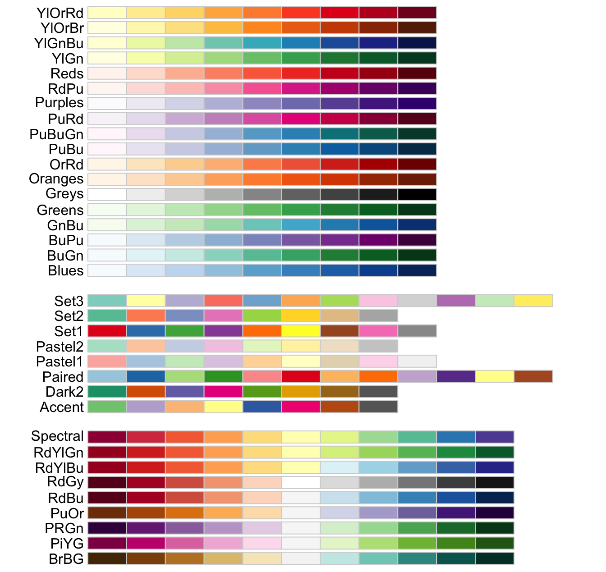
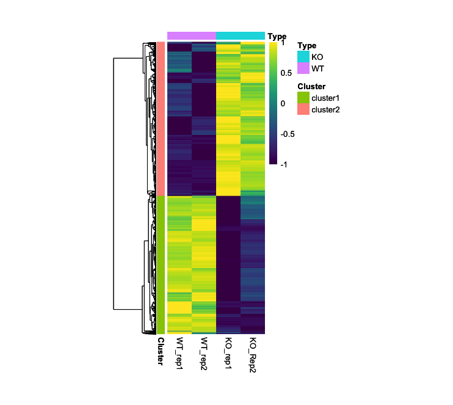
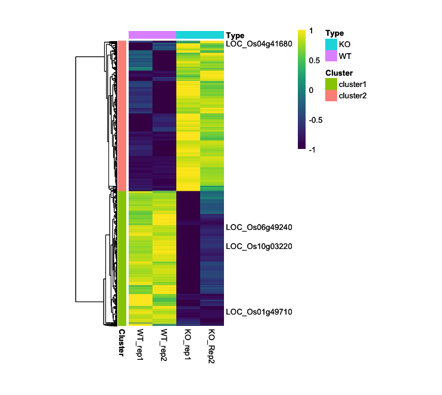
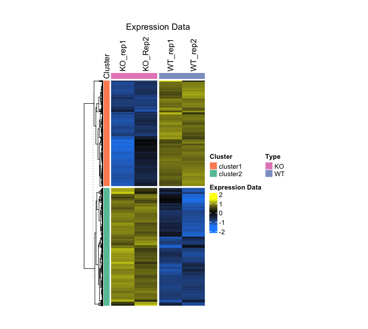
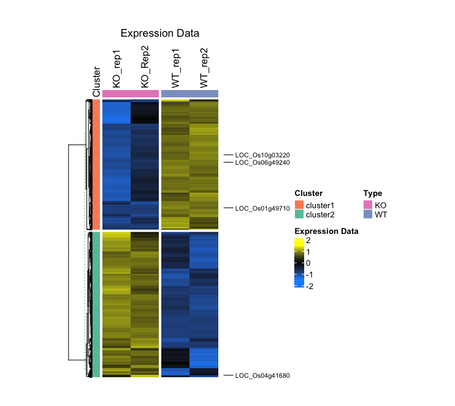
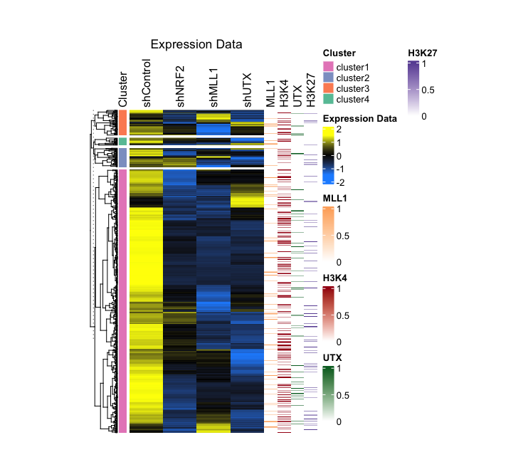
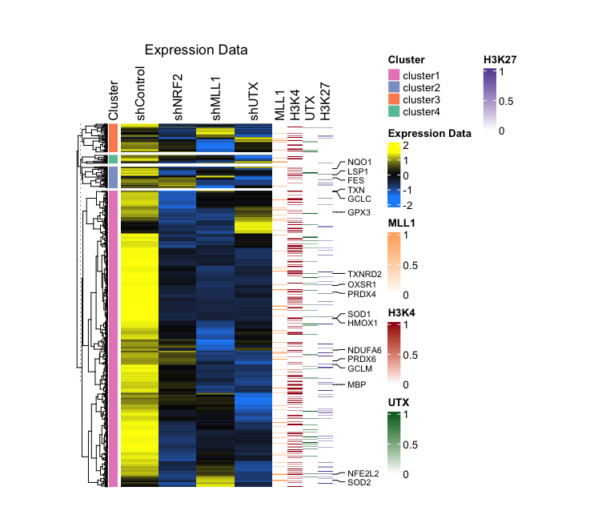
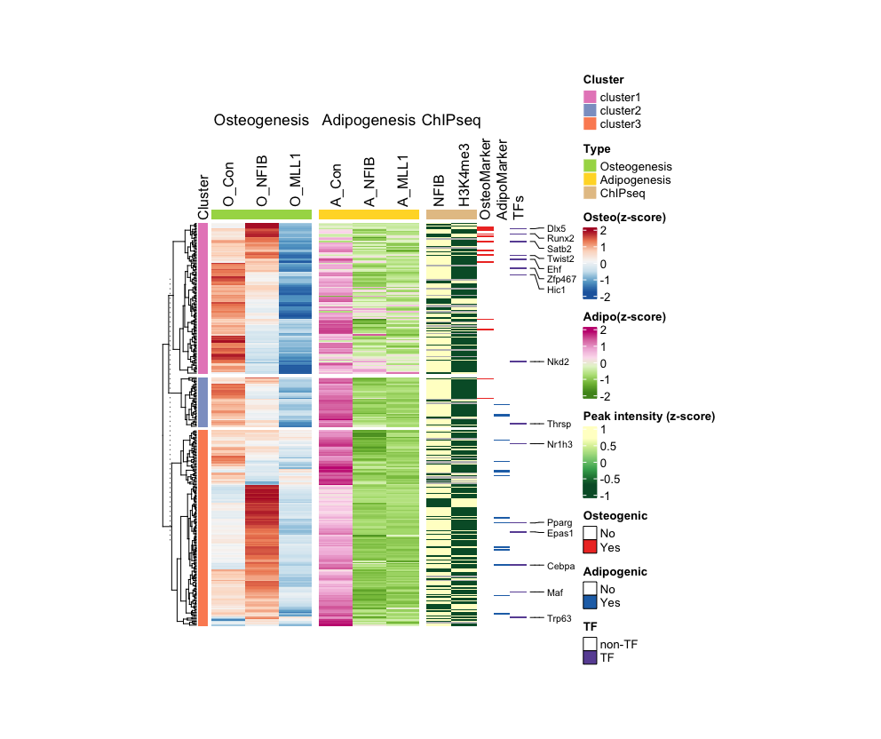

© 2022 Janghyun Choi<br>This work is licensed under a [Creative Commons Attribution-NonCommercial-ShareAlike 4.0 International License](https://creativecommons.org/licenses/by-nc-sa/4.0/).<br> [](http://creativecommons.org/licenses/by-nc-sa/4.0/)

# Essential Tools for Heatmap Visualization in Sequencing Data: pheatmap and ComplexHeatmap
In the analysis of sequencing data, drawing heatmaps is crucial for visualizing complex information in a comprehensible manner, allowing researchers to detect patterns, correlations, and outliers within large datasets. Heatmaps represent matrix data where individual values contained in a matrix are represented as colors, facilitating the quick absorption of insights about the underlying biological processes. Among the tools available for this purpose in R, the pheatmap and ComplexHeatmap packages are particularly noteworthy. The pheatmap package provides a simple and highly customizable interface for generating heatmaps, offering features such as clustering, annotation, and adjustments to color scales. On the other hand, ComplexHeatmap extends these functionalities by enabling the integration of multiple heatmaps, adding complex annotations, and supporting the arrangement of heatmaps and other graphical elements in a highly flexible manner. This protocol was developed using a system equipped with an Intel 10th generation i9-10910 processor and 48GB of memory. The test environment includes **R version 4.4.0 running on macOS 14.4.1**.

## pheatmap versus ComplexHeatmap
The packages `pheatmap` and `complexheatmap` are both apt for the generation of heatmaps, albeit with distinct differences. Refer to the following table, which outlines the respective advantages and disadvantages of each package, and select the corresponding manuals for further guidance. Additionally, unlike other plotting tutorials (Volcano, scatter, correlation, and buble chart), this guide incorporates complex parameters and fundamental logical functions of R, necessitating a foundational understanding of the R programming language. Specifically, the `complexheatmap` package is designed for users with an intermediate level of expertise.

| Aspect                       | pheatmap                                               | ComplexHeatmap                                       |
|------------------------------|--------------------------------------------------------|------------------------------------------------------|
| **Ease of Use**              | More effective for beginners and quick implementations | Less straightforward initially, better for experienced users |
| **Customization and Flexibility** | Limited in customization, suitable for basic heatmaps | Highly customizable, ideal for detailed visualizations |
| **Integration with Other Data Types and Visuals** | Less effective for complex data integration  | Highly effective for integrating multiple data types and visuals |
| **Performance and Scalability** | Good for smaller datasets and simpler analyses         | Superior for large datasets and complex analyses     |

## pheatmap
   [](https://github.com/raivokolde/pheatmap) [](https://cran.r-project.org/web/packages/pheatmap/index.html) [](https://cran.r-project.org/web/checks/check_results_pheatmap.html) [](https://github.com/raivokolde/pheatmap)

In this section, the user is introduced to the techniques for visualizing basic RNA-seq data through heatmaps, using the `pheatmap` package. The dataset featured originates from CPM values, which were collected following RNA-seq assays on duplicate samples of both wild-type rice and genetically modified rice with certain genes knockouted. Please be advised that the `pheatmap` package supports only fundamental heatmap visualization. For an in-depth examination of advanced features, one is directed to consult the section dedicated to the `complexheatmap` package, which follows.

raivokolde/pheatmap

**Required Packages:**
```R
library(pheatmap)
library(RColorBrewer)
library(viridis)
library(viridisLite)
```

### Step-by-Step pheatmap Guide
- **GEO accession number used in this manual**: Unpublished (to be available after post-publication)

#### 1. Load CPM Data and Prepare Data Frame
Load your data. In this guide, I will load CPM data without using `row.names = 1`, **but this is optional**:
```R
data <- read.csv("heatmap.csv", header = T)
```
- This dataset is organized as follows:
  ```
  > head(data)
              MSU  WT_rep1  WT_rep2    KO_rep1    KO_Rep2  Cluster
  1 LOC_Os02g57000 6.475709 6.216468 -3.0875734 -3.3857658 cluster1
  2 LOC_Os02g33740 5.597263 5.432519 -2.3418637 -3.0058172 cluster1
  3 LOC_Os03g59300 6.656864 6.558811  0.3320713  0.3533387 cluster1
  4 LOC_Os01g21580 4.679595 4.487096 -2.7940856 -2.7053595 cluster1
  5 LOC_Os02g03640 4.724022 4.939755 -2.1597539 -1.8963395 cluster1
  6 LOC_Os09g29050 5.663938 5.379374 -0.4579156 -0.2427508 cluster1
  ```
Select the values in the data that will be analyzed and specify their row names as gene numbers (`data$MSU`):
```R
rownames(data) <- data$MSU
expression_data <- data[, 2:5]
```
- The data frame of `expression_data` is organized as follows:
  ```
  > head(expression_data)
                  WT_rep1  WT_rep2    KO_rep1    KO_Rep2
  LOC_Os02g57000 6.475709 6.216468 -3.0875734 -3.3857658
  LOC_Os02g33740 5.597263 5.432519 -2.3418637 -3.0058172
  LOC_Os03g59300 6.656864 6.558811  0.3320713  0.3533387
  LOC_Os01g21580 4.679595 4.487096 -2.7940856 -2.7053595
  LOC_Os02g03640 4.724022 4.939755 -2.1597539 -1.8963395
  LOC_Os09g29050 5.663938 5.379374 -0.4579156 -0.2427508
  ```

#### 2. Create Annotation Frames for Rows and Columns
The rows of the dataset are divided by the `Cluster` of `data` and the columns are divided by the head of the data to create the annotation:
```R
# For row
annotation <- data.frame(Cluster = factor(data$Cluster))
rownames(annotation) <- rownames(data)

#For column
annotation_col <- data.frame(Type = factor(c("WT", "WT", "KO", "KO")))
rownames(annotation_col) <- colnames(expression_data)
```
- The structure of the `annotation` and `annotation_col` data frames is shown below: 
  ```
  > head(annotation)
                  Cluster
  LOC_Os02g57000 cluster1
  LOC_Os02g33740 cluster1
  LOC_Os03g59300 cluster1
  LOC_Os01g21580 cluster1
  LOC_Os02g03640 cluster1
  LOC_Os09g29050 cluster1

  > annotation_col
          Type
  WT_rep1   WT
  WT_rep2   WT
  KO_rep1   KO
  KO_Rep2   KO
  ```

#### 3. Prepare Color Palette for the Heatmap
Choose a color scheme for your heatmap visualization. This can be done by specifying either the name or hex codes of colors:
```R
myCol <- colorRampPalette(c('dodgerblue', 'black', 'yellow'))(100)
```
- The number `100` represents the granularity of the heatmap, affecting the differentiation between data points. More colors provide finer distinctions, helpful for detailed data visualization, whereas fewer colors might emphasize broader trends.

If you need a broader range of color palettes, the `RColorBrewer` package offers a variety of user-favorite choices:
```R
myCol <- colorRampPalette(brewer.pal(11, "RdYlBu"))(100)
myCol_reverse <- colorRampPalette(rev(brewer.pal(11, "RdYlBu")))(100)
```
- In these codes, `"RdYlBu"` indicates a specific color palette, the number `11` specifically refers to the number of different colors that you want to extract from the "RdYlBu" palette provided by the RColorBrewer package. The number of `100` means the granularity in the heatmap. The `rev` argument is used to reverse the color order. The available color codes and numbers are shown below image.

<p align="center">
    
</p>


The `viridis` package is also a good one that provides a palette for color selection.
```R
myCol <- viridis::viridis(100, option = "magma")
myCol_magma_rev <- viridis::viridis(100, option = "magma", direction = -1)
```
The following images display the available color palettes from Viridis:

<div style="text-align: center;">
  
</div>

#### 4. Plotting
```R
myCol <- viridis::viridis(100, option = "viridis")
pheatmap_result <- pheatmap(expression_data, 
         annotation_row = annotation,
         annotation_col = annotation_col,
         cluster_rows = TRUE, cluster_cols = FALSE,
         show_rownames = FALSE, show_colnames = TRUE,
         scale = "row", 
         color = myCol,
         clustering_distance_rows = "euclidean",
         clustering_method = "average",
         cellheight = 0.06, cellwidth = 30)
```

**Important:** Typically, heatmap data is normalized and presented as a z-score to ensure comparability across data points. In the provided example, normalization is achieved by computing a z-score with the `scale = "row"` option directly in the heatmap function, thus eliminating the need for using the `t(scale(t()))` function.

- These codes utilize `Euclidean` distance for clustering and employs the `average` algorithm. **To modify the clustering distance, add the `clustering_distance_rows = "<distance>"` parameter.** Available `distance` metrics include `euclidean`, `maximum`, `manhattan`, `canberra`, and `binary`. Additionally, **to change the clustering algorithm, adjust the `clustering_method = "<algorithm>"` parameter.** Possible algorithms are `single` (minimum linkage), `complete` (maximum linkage), `average` (UPGMA), `ward.D` (Ward's minimum variance method), `ward.D2` (Modified Ward's method), `mcquitty` (McQuitty's method, WPGMA), `median` (Median linkage, WPGMC), and `centroid` (Centroid linkage, UPGMC).

- If you want to adjust the range of the heatmap, you can do so using the `breaks` argument:
  ```R
  my_breaks <- seq(-1, 1, length.out = length(myCol) + 1)
  pheatmap_result_Rev <- pheatmap(expression_data, 
          annotation_row = annotation,
          annotation_col = annotation_col,
          cluster_rows = TRUE, cluster_cols = FALSE,
          show_rownames = FALSE, show_colnames = TRUE,
          scale = "row", 
          color = myCol,
          breaks = my_breaks,
          clustering_distance_rows = "euclidean",
          clustering_method = "average",
          cellheight = 0.06, cellwidth = 30)
  ```

- You can also output a list of genes in clustering order:
  ```R
  clustered_gene_order <- rownames(expression_data)[pheatmap_result$tree_row$order]
  clustered_genes_with_clusters <- data.frame(
    Gene = clustered_gene_order,
    OriginalCluster = annotation[clustered_gene_order, "Cluster"]
  )
  # Save the list as a csv format
  write.csv(clustered_genes_with_clusters, file = "clustered_genes_with_clusters.csv", row.names = FALSE, quote = FALSE)
  ```
#### 5. (Optional) Represent Specific Gene Symbols in the Heatmap
Although this functionality is not fully implemented in the current setup, it is recommended to use the `ComplexHeatmap` package for a robust implementation of this featur
```R
# Specify the genes whose names you want to be displayed
selected_genes <- c("LOC_Os06g49240", "LOC_Os01g49710", "LOC_Os10g03220", "LOC_Os04g41680")
labels_row <- ifelse(rownames(expression_data) %in% selected_genes, rownames(expression_data), "")

# Plotting
pheatmap_result_Name <- pheatmap(expression_data, 
         annotation_row = annotation,
         annotation_col = annotation_col,
         cluster_rows = TRUE, cluster_cols = FALSE,
         show_rownames = TRUE, show_colnames = TRUE,
         labels_row = labels_row,
         scale = "row", 
         color = myCol,
         breaks = my_breaks,
         clustering_distance_rows = "euclidean",
         clustering_method = "average",
         cellheight = 0.06, cellwidth = 30)
```
- **Output (Left; Step4, Right; Step5):**
<p align="center">
    
    
</p>


## CompexHeatmap
   [](https://github.com/jokergoo/ComplexHeatmap) [](https://jokergoo.github.io/ComplexHeatmap-reference/book/) [](https://bioconductor.org/packages/release/bioc/html/ComplexHeatmap.html) [](https://github.com/jokergoo/ComplexHeatmap/releases) [](https://github.com/jokergoo/ComplexHeatmap)

In this section, the `complexheatmap` package will be elucidated through the analysis of three distinct case studies. **Initially**, data from a heatmap generated using the 'pheatmap' package will be implemented employing the 'complexheatmap' package. **Subsequently**, the integration of RNA-seq and ChIP-seq data will be demonstrated, utilizing the data integration parameters that constitute a principal feature of this package. **Lastly**, the process for integrating various RNA-seq datasets will be discussed.

**Required Packages:**
```R
library(ComplexHeatmap)
library(circlize)
library(grid)
library(RColorBrewer)
library(viridis)
library(viridisLite)
```
- If you do not possess specialized knowledge, the use of the `ht_opt` function in the Complexheatmap may not be advisable. It is important to note that this function's settings depend permanently on the previously saved value, even after re-invoking the library. If a reset is necessary, please utilize the command provided below.
  ```R
  ht_opt(Reset = TRUE)
  print(ht_opt) # Check
  ```

### Step-by-Step Guide: Case I - RNA-seq Heatmap
In this case, I will visualize the CPM values of wild-type rice and rice with a specific gene has been knocked out, through the application of biological replicates. The data were subjected to DEG analysis using `edgeR`. Additionally, I have generated a `Cluster` row labeled `cluster1` for genes that are upregulated and `cluster2` for genes that are downregulated.
- **GEO accession number used in this manual**: Unpublished (to be available after post-publication)

#### 1. Load Data and Normalize with z-score
```R
# Load data without the 'row.names' option
data <- read.csv("heatmap.csv", header = T)

# Specify the range of the data to be analyzed
expression_data <- as.matrix(data[, 2:5])

# Normalize to z-score
z_score <- t(scale(t(expression_data)))
z_min <- min(z_score)
z_max <- max(z_score)
rownames(z_score) <- data$MSU
```
- **Output**:
  ```
  > head(data)
              MSU  WT_rep1  WT_rep2    KO_rep1    KO_Rep2  Cluster
  1 LOC_Os02g57000 6.475709 6.216468 -3.0875734 -3.3857658 cluster1
  2 LOC_Os02g33740 5.597263 5.432519 -2.3418637 -3.0058172 cluster1
  3 LOC_Os03g59300 6.656864 6.558811  0.3320713  0.3533387 cluster1
  4 LOC_Os01g21580 4.679595 4.487096 -2.7940856 -2.7053595 cluster1
  5 LOC_Os02g03640 4.724022 4.939755 -2.1597539 -1.8963395 cluster1
  6 LOC_Os09g29050 5.663938 5.379374 -0.4579156 -0.2427508 cluster1

  > head(z_score)
                  WT_rep1   WT_rep2    KO_rep1    KO_Rep2
  LOC_Os02g57000 0.8890761 0.8422390 -0.8387204 -0.8925947
  LOC_Os02g33740 0.8819111 0.8471257 -0.7944220 -0.9346147
  LOC_Os03g59300 0.8795228 0.8524170 -0.8689095 -0.8630303
  LOC_Os01g21580 0.8885737 0.8431155 -0.8763208 -0.8553683
  LOC_Os02g03640 0.8382743 0.8927108 -0.8987265 -0.8322585
  LOC_Os09g29050 0.9071574 0.8232973 -0.8969315 -0.8335232
  ```
#### 2. Prepare Cluster Annotations
```R
# Create a factor for the cluster data and setup the annotation dataframe
cluster_factor <- factor(data$Cluster)
annotation <- data.frame(Cluster = cluster_factor)
rownames(annotation) <- data$MSU

# Define a color palette
set2_palette <- brewer.pal(8, "Set2")

# Create row annotations
row_anno <- rowAnnotation(
  df = annotation,
  col = list(Cluster = setNames(c(set2_palette[2], set2_palette[1]), levels(cluster_factor))),
  annotation_name_side = "top",
  simple_anno_size = unit(3, "mm")
)

# Create column annotations
col_anno <- HeatmapAnnotation(
  Type = factor(c("WT", "WT", "KO", "KO")),
  col = list(Type = c(WT = set2_palette[3], KO = set2_palette[4])),
  show_annotation_name = FALSE,  
  simple_anno_size = unit(3, "mm")
)
```
- **Output**:
  ```
  > row_anno
  A HeatmapAnnotation object with 1 annotation
    name: heatmap_annotation_0 
    position: row 
    items: 5981 
    width: 3mm 
    height: 1npc 
    this object is subsettable
    14.4069666666667mm extension on the top 

      name annotation_type color_mapping width
  Cluster discrete vector  user-defined   3mm
  > col_anno
  A HeatmapAnnotation object with 1 annotation
    name: heatmap_annotation_1 
    position: column 
    items: 4 
    width: 1npc 
    height: 3mm 
    this object is subsettable

  name annotation_type color_mapping height
  Type discrete vector  user-defined    3mm
  ```

#### 3. Plotting
```R
main_heatmap <- Heatmap(
  z_score,
  name = "Expression Data",
  col = colorRamp2(c(z_min, 0, z_max), c('dodgerblue', 'black', 'yellow')),
  show_row_names = FALSE,
  show_column_names = TRUE,
  column_title = "Expression Data",
  clustering_method_rows = "average",
  cluster_columns = FALSE,  
  column_names_side = "top",  
  column_split = factor(c("WT", "WT", "KO", "KO")),
  top_annotation = col_anno,  
  split = cluster_factor,
  row_title = NULL,
  left_annotation = row_anno,
  width = unit(5, "cm"),
  height = unit(12, "cm")
)

draw(main_heatmap)
```
- These codes utilize `Euclidean` distance for clustering and employs the `complete` algorithm (Default). **To modify the clustering distance, add the `clustering_distance_rows = "<distance>"` parameter.** Available `distance` metrics include `euclidean`, `maximum`, `manhattan`, `canberra`, and `binary`. Additionally, **to change the clustering algorithm, adjust the `clustering_method_rows = "<algorithm>"` parameter.** Possible algorithms are `single` (minimum linkage), `complete` (maximum linkage), `average` (UPGMA), `ward.D` (Ward's minimum variance method), `ward.D2` (Modified Ward's method), `mcquitty` (McQuitty's method, WPGMA), `median` (Median linkage, WPGMC), and `centroid` (Centroid linkage, UPGMC).

- **Output**:


#### 4. (Optional) Represent specific gene symbols in the heatmap
```R
# Specify the genes whose names you want to be displayed
selected_genes <- c("LOC_Os06g49240", "LOC_Os01g49710", "LOC_Os10g03220", "LOC_Os04g41680")
row_indices <- which(data$MSU %in% selected_genes)

# Plotting
main_heatmap2 <- main_heatmap + rowAnnotation(
  foo = anno_mark(
    at = row_indices,  
    labels = data$MSU[row_indices],
    which = "row",  
    labels_gp = gpar(fontsize = 8))
)

# Save
draw(main_heatmap2, merge_legends = TRUE, gap = unit(0, "mm"))
```
- **Output (Left; Step3, Right; Step4):**
<p align="center">
    
    
</p>

### Step-by-Step Guide: Case II - Integration of RNA-seq with Simpler Structured Dataset
In this dataset, genes that respond to stress in human keratinocytes and three derived knockdown cell types are categorized by their fold change values, using normal cell expression levels as a baseline. Then, these genes were manually grouped into four categories (`Cluster`row) based on their expression patterns. Additionally, genes associated with ROS are enumerated in a separate row (`ROS.hallmark`) and identified as `ROS`. Moreover, the presence of MLL1, H3K4me3, UTX, and H3K27me3 peaks, as detected in normal cells under stress conditions from ChIP-seq results, is indicated by `0` (NO) and `1` (Yes) values.
- **GEO accession number used in this manual**: Unpublished (to be available after post-publication)

#### 1. Normalize data and prepare matrix/annotation
```R
# Load data
data <- read.csv("ROS_heatmap.csv", header = T)

# Matrix the data as main heatmap and Normalize to Z-score.
expression_data <- as.matrix(data[, 2:5])
z_score <- t(scale(t(expression_data)))
z_min <- min(z_score)
z_max <- max(z_score)

# Create the annotation dataframe and set annotation
cluster_factor <- factor(data$Cluster)
annotation <- data.frame(Cluster = cluster_factor)
rownames(annotation) <- rownames(data)
set2_palette <- brewer.pal(8, "Set2")
row_anno <- rowAnnotation(
  df = annotation,
  col = list(Cluster = setNames(c(set2_palette[4], set2_palette[3], set2_palette[2], set2_palette[1]), levels(cluster_factor))),
  annotation_name_side = "top",
  simple_anno_size = unit(3, "mm")
)
```
- This dataset used in this case is organized as follows:
  ```
  > head(data)
    SYMBOL shControl   shNRF2     shMLL1      shUTX  Cluster ROS.hallmark MLL1 H3K4 UTX H3K27
  1  HHATL  1.191316 1.473315 -3.0637972  0.1852907 cluster2                 0    0   0     0
  2    AHR  1.478816 1.352787 -3.0637972  0.0000000 cluster2                 1    0   0     0
  3   NQO1  3.706885 1.283004  0.0000000 -1.2765334 cluster2          ROS    0    1   0     0
  4   SSPN  1.076450 1.185496 -0.3337084 -3.2310447 cluster2                 0    0   0     0
  5  G6PC1  1.386497 2.442824 -0.1576905 -0.1286908 cluster2                 0    0   0     1
  6 PPP6R2  4.561280 4.742004 -0.1064526  3.1118796 cluster2                 0    0   0     0
  ```
Next, matrix the dataset (ChIP-seq) that will be used as the secondary heatmap.
```R
mll1_data <- matrix(data$MLL1, ncol=1, dimnames = list(rownames(data), "MLL1"))
h3k4_data <- matrix(data$H3K4, ncol=1, dimnames = list(rownames(data), "H3K4"))
utx_data <- matrix(data$UTX, ncol=1, dimnames = list(rownames(data), "UTX"))
h3k27_data <- matrix(data$H3K27, ncol=1, dimnames = list(rownames(data), "H3K27"))
```

#### 2. Plotting

Create color palettes for the secondary heatmap.
```R
oranges_palette <- c("white", brewer.pal(9, "Oranges"))
reds_palette <- c("white", brewer.pal(9, "Reds"))
greens_palette <- c("white", brewer.pal(9, "Greens"))
purples_palette <- c("white", brewer.pal(9, "Purples"))
```

Draw the secondary heatmap.
```R
mll1_heatmap <- Heatmap(mll1_data, col = colorRamp2(c(0, 1), c("white", oranges_palette[5])), 
                        name = "MLL1", cluster_columns = FALSE, show_row_names = FALSE, 
                        show_column_names = TRUE, column_names_side = "top", width = unit(0.5, "cm"))
h3k4_heatmap <- Heatmap(h3k4_data, col = colorRamp2(c(0, 1), c("white", reds_palette[9])), 
                        name = "H3K4", cluster_columns = FALSE, show_row_names = FALSE, 
                        show_column_names = TRUE, column_names_side = "top", width = unit(0.5, "cm"))
utx_heatmap <- Heatmap(utx_data, col = colorRamp2(c(0, 1), c("white", greens_palette[9])), 
                       name = "UTX", cluster_columns = FALSE, show_row_names = FALSE, 
                       show_column_names = TRUE, column_names_side = "top", width = unit(0.5, "cm"))
h3k27_heatmap <- Heatmap(h3k27_data, col = colorRamp2(c(0, 1), c("white", purples_palette[8])), 
                         name = "H3K27", cluster_columns = FALSE, show_row_names = FALSE, 
                         show_column_names = TRUE, column_names_side = "top", width = unit(0.5, "cm"))
```

Draw a main heatmap.
```R
main_heatmap <- Heatmap(z_score, name = "Expression Data",
                        col = colorRamp2(c(z_min, 0, z_max), c('dodgerblue', 'black', 'yellow')),
                        show_row_names = TRUE, show_column_names = TRUE,
                        column_title = "Expression Data",
                        cluster_columns = FALSE,  
                        column_names_side = "top",  
                        split = cluster_factor, 
                        row_title = NULL,
                        left_annotation = row_anno,
                        width = unit(5, "cm"),  
                        height = unit(12, "cm"))
```

Combine the main heatmap with the secondary heatmap.
```R
heatmap_list <- main_heatmap + mll1_heatmap + h3k4_heatmap + utx_heatmap + h3k27_heatmap

# Draw without margin
draw(heatmap_list, merge_legends = TRUE, gap = unit(0, "mm"))
```

#### 3. (Optional) Showing specific gene symbols from a large list in a heatmap

If the `ROS.hallmark` row is marked `ROS`, display the corresponding value from the `SYMBOL` row and annotate it accordingly:
```R
# Specify ROS markers 
ros_indices <- which(data$ROS.hallmark == "ROS")

# Reflect these markers on the last heatmap among the secondary heatmaps
h3k27_heatmap_Rev <- h3k27_heatmap + rowAnnotation(
  foo = anno_mark(
    at = ros_indices,  
    labels = data$SYMBOL[ros_indices],
    which = "row",  
    labels_gp = gpar(fontsize = 8))
)

# Simple version
h3k27_heatmap_Rev = h3k27_heatmap + rowAnnotation(
  foo = anno_mark(
    at = ros_indices, 
    labels = data$SYMBOL[ros_indices], 
    which = "row")
)

# Advanced version
h3k27_heatmap_Rev <- h3k27_heatmap + rowAnnotation(
  foo = anno_mark(
    at = ros_indices,  
    labels = data$SYMBOL[ros_indices],
    which = "row",  
    labels_gp = gpar(fontsize = 8),  
    padding = unit(0.5, "cm")  
  ),
  width = unit(5.0, 'cm') + max_text_width(ros_indices, gp = gpar(fontsize = 8)) 
)  
```

I typically apply these markers to the auxiliary heatmap rather than the primary one, and their inclusion is not obligatory. Please designate these markers accordingly and subsequently integrate your heatmaps:

```R
# Combine
heatmap_final <- main_heatmap + mll1_heatmap + h3k4_heatmap + utx_heatmap + h3k27_heatmap_Rev

# Draw
draw(heatmap_final, merge_legends = TRUE, gap = unit(0, "mm"))
```
- **Output (Left; Step2, Right; Step3):**
<p align="center">
    
    
</p>

### Step-by-Step Guide: Case III - Multiple RNA-seq Combined with ChIP-seq
This example involves big data set derived from mouse mesenchymal stem cells (MSCs) and three different knockdown cell lines following their differentiation into osteoblasts and adipocytes, respectively. The primary data set comprises RNA-seq results from these cell lines undergone each differential stimuli. Additionally, as secondary data, ChIP-seq results are utilized for the genome-wide identification of alterations in the occupancy and enrichment of NFIB and H3K4me3 following the induction of bone differentiation in intact MSCs. Lastly, I present a heatmap to show whether the list of genes analyzed are transcription factors and regulators of each differentiation process.
- **GEO accession number used in this manual**: Unpublished (to be available after post-publication)

#### 1. Normalize data and prepare matrix/annotation
Load data:
```R
data <- read.csv("ComplexSeq.csv", header = T)
```
- This dataset used in this case is organized as follows:
```
> head(data)
         Symbol     O_Con    O_NFIB     O_MLL1    A_Con    A_NFIB     A_MLL1     NFIB  H3K4me3 TF Adipo Osteo  Cluster
1 1500009L16Rik 1.7141525  1.650957 -8.2522356 5.884279 -2.097777 -5.0292486 2.296628 1.787946  0     0     0 cluster2
2 A530016L24Rik 0.7738813  1.030212 -0.5199491 4.063868 -3.585915 -1.7736988 1.149132 1.370758  0     0     0 cluster3
3         Abca1 1.8617470  6.888385  0.5757785 3.776418 -2.151568 -1.5198181 2.175035 1.841612  0     0     0 cluster3
4        Abhd15 1.4146485 -0.256023 -0.3941591 3.219146 -3.508747 -3.6085345 2.350038 0.000000  0     0     0 cluster3
5         Acacb 2.4237469  2.502078 -1.0830766 2.121201 -1.460384 -0.6849265 1.762528 0.000000  0     0     0 cluster1
6         Acadm 0.7387791  6.690138 -0.1115445 1.582898 -1.675392 -1.2446482 1.935325 1.584191  0     0     0 cluster3
```
Create and normalize data frames by experiment type and sample type:
```R
# For RNA-seq
RNA_data <- as.matrix(data[, 2:7])
RNA_z_score <- t(scale(t(RNA_data)))
rownames(RNA_z_score) <- rownames(data)
Osteo <- as.matrix(RNA_z_score[, 1:3])
Adipo <- as.matrix(RNA_z_score[, 4:6])

# For ChIP-seq
ChIP_data <- as.matrix(data[, 8:9])
ChIP_z_score <- t(scale(t(ChIP_data)))
rownames(ChIP_z_score) <- rownames(data)
```
Create annotation:
```R
# Specifies color code and sets annotation for the row
set2_palette <- brewer.pal(8, "Set2")
cluster_factor <- factor(data$Cluster)
annotation <- data.frame(Cluster = cluster_factor)
rownames(annotation) <- rownames(data)

# Create row annotation
row_anno <- rowAnnotation(
  df = annotation,
  col = list(Cluster = setNames(c(set2_palette[4], set2_palette[3], set2_palette[2]), levels(cluster_factor))),
  annotation_name_side = "top",
  simple_anno_size = unit(3, "mm")
)
ordered_levels <- c("cluster3", "cluster2", "cluster1")
cluster_factor_ordered <- factor(cluster_factor, levels = ordered_levels)

# Create column annotation
col_osteo_anno <- HeatmapAnnotation(
  Type = factor(c("Osteogenesis", "Osteogenesis", "Osteogenesis")),
  col = list(Type = c(Osteogenesis = set2_palette[5])),
  show_annotation_name = FALSE,  
  simple_anno_size = unit(3, "mm")
)

col_adipo_anno <- HeatmapAnnotation(
  Type = factor(c("Adipogenesis", "Adipogenesis", "Adipogenesis")),
  col = list(Type = c(Adipogenesis = set2_palette[6])),
  show_annotation_name = FALSE,  
  simple_anno_size = unit(3, "mm")
)

col_chip_anno <- HeatmapAnnotation(
  Type = factor(c("ChIPseq", "ChIPseq")),
  col = list(Type = c(ChIPseq = set2_palette[7])),
  show_annotation_name = FALSE,  
  simple_anno_size = unit(3, "mm")
)

column_split_factor <- factor(
    c("Osteogenesis", "Osteogenesis", "Osteogenesis", "Adipogenesis", "Adipogenesis", "Adipogenesis", "ChIPseq", "ChIPseq"),
    levels = c("Osteogenesis", "Adipogenesis", "ChIPseq")
)
```
#### 2. Plotting

Create color palettes and plot the main heatmaps:
```R
# Specifies colocr pallettes
osteo_color <- colorRampPalette(rev(brewer.pal(7, "RdBu")))
osteo_color_function = osteo_color(256)
adipo_color <- colorRampPalette(rev(brewer.pal(8, "PiYG")))
adipo_color_function = adipo_color(256)
chip_color <- colorRampPalette(rev(brewer.pal(7, "YlGn")))
chip_color_function = chip_color(256)

# Osteogenic RNA-seq heatmap (as a main heatmap)
osteo_heatmap <- Heatmap(
  Osteo,
  col = osteo_color_function,
  show_row_names = FALSE,
  show_column_names = TRUE,
  name = "Osteo(z-score)",
  cluster_columns = FALSE,  
  column_names_side = "top",  
  column_split = factor(c("Osteogenesis", "Osteogenesis", "Osteogenesis")),
  top_annotation = col_osteo_anno,  
  split = cluster_factor_ordered,
  row_title = NULL,
  left_annotation = row_anno,
  width = unit(3, "cm"),
  height = unit(12, "cm"),
)

# Adipogenic RNA-seq heatmap
adipo_heatmap <- Heatmap(
  Adipo,
  col = adipo_color_function,
  show_row_names = FALSE,
  show_column_names = TRUE,
  name = "Adipo(z-score)",
  cluster_columns = FALSE,
  column_names_side = "top",  
  column_split = factor(c("Adipogenesis", "Adipogenesis", "Adipogenesis")),
  top_annotation = col_adipo_anno,  
  row_title = NULL,
  width = unit(3, "cm"),
  height = unit(12, "cm")
)
# ChIP-seq heatmap
chip_heatmap <- Heatmap(
  ChIP_z_score,
  col = chip_color_function,
  show_row_names = FALSE,
  show_column_names = TRUE,
  name = "Peak intensity (z-score)",
  cluster_columns = FALSE,
  column_names_side = "top",  
  column_split = factor(c("ChIPseq", "ChIPseq")),
  top_annotation = col_chip_anno,  
  row_title = NULL,
  width = unit(1.5, "cm"),
  height = unit(12, "cm")
)

# combine and draw
comb <- osteo_heatmap + adipo_heatmap + chip_heatmap
draw(comb)
```

Crate a data frame and matrix it for the secondary heatmaps:
```R
adipo_data <- matrix(data$Adipo, ncol=1, dimnames = list(rownames(data), "AdipoMarker"))
osteo_data <- matrix(data$Osteo, ncol=1, dimnames = list(rownames(data), "OsteoMarker"))
TF_data <- matrix(data$TF, ncol=1, dimnames = list(rownames(data), "TFs"))

# Make sure you have NA in your data, in this example, NA is converted to '0' as shown below.
TF_data[is.na(TF_data)] <- 0
```

Create color palettes and plot the secondary heatmaps:
```R
reds_palette <- c("white", brewer.pal(9, "Reds"))
blues_palette <- c("white", brewer.pal(9, "Blues"))
purples_palette <- c("white", brewer.pal(9, "Purples"))

# Osteogenic markers heatmap with box legend
osteo_marker_heatmap <- Heatmap(osteo_data, 
                       col = c("white", reds_palette[7]), 
                       name = "Osteogenic Factor", 
                       cluster_columns = FALSE, 
                       show_row_names = FALSE, 
                       show_column_names = TRUE, 
                       column_names_side = "top", 
                       width = unit(0.5, "cm"),
                       heatmap_legend_param = list(
                           title = "Osteogenic",
                           labels = c("No", "Yes"), 
                           at = c(0, 1),                
                           legend_gp = gpar(fill = c("white", reds_palette[8]), col = "black", border = TRUE), 
                           labels_gp = gpar(fontsize = 10),
                           border = TRUE
                       ))

# Adipogenic markers heatmap with box legend
adipo_marker_heatmap <- Heatmap(adipo_data, 
                       col = c("white", blues_palette[8]), 
                       name = "Adipogenic Factor", 
                       cluster_columns = FALSE, 
                       show_row_names = FALSE, 
                       show_column_names = TRUE, 
                       column_names_side = "top", 
                       width = unit(0.5, "cm"),
                       heatmap_legend_param = list(
                           title = "Adipogenic",
                           labels = c("No", "Yes"), 
                           at = c(0, 1),                
                           legend_gp = gpar(fill = c("white", blues_palette[8]), col = "black", border = TRUE), 
                           labels_gp = gpar(fontsize = 10),
                           border = TRUE
                       ))

# TF heatmap with box legend
TF_heatmap <- Heatmap(TF_data, 
                       col = c("white", purples_palette[8]), 
                       name = "Transcription Factor", 
                       cluster_columns = FALSE, 
                       show_row_names = FALSE, 
                       show_column_names = TRUE, 
                       column_names_side = "top", 
                       width = unit(0.5, "cm"),
                       heatmap_legend_param = list(
                           title = "TF",
                           labels = c("non-TF", "TF"), 
                           at = c(0, 1),                
                           legend_gp = gpar(fill = c("white", purples_palette[8]), col = "black", border = TRUE), 
                           labels_gp = gpar(fontsize = 10),
                           border = TRUE
                       ))

comb2 <- osteo_heatmap + adipo_heatmap + chip_heatmap + osteo_marker_heatmap + adipo_marker_heatmap + TF_heatmap
draw(comb2)
```

#### 3. Showing Specific Gene Symbols in the Heatmap
Select a specific gene list and create logic to display it in the heatmap:
```R
# Specific gene list
selected_genes <- c("Cebpa", "Dlx5", "Ehf", "Epas1", "Hic1", "Maf", "Nkd2", "Nr1h3", "Pparg", "Runx2", "Satb2", "Thrsp", "Trp63", "Twist2", "Zfp467")

# Find the specific gene among input data index
row_indices <- which(data$Symbol %in% selected_genes)

# Apply the logic on the heatmap
TF_heatmap_Rev <- TF_heatmap + rowAnnotation(
  foo = anno_mark(
    at = row_indices,  
    labels = data$Symbol[row_indices],
    which = "row",  
    labels_gp = gpar(fontsize = 8))
)
```

- **Output (Left; Step2, Right; Step3):**
<div style="text-align: center; margin: 0;">
    
</div>

# Citations
- pheatmap

**Kolde, R.**, & Kolde, M. R. (2015). **Package ‘pheatmap’**. *R package*, 1(7), 790. [PDF](https://cran.ms.unimelb.edu.au/web/packages/pheatmap/pheatmap.pdf)

- complexHeatmap

Gu, Z., & Hübschmann, D. (2022). Make interactive complex heatmaps in R. Bioinformatics, 38(5), 1460-1462. [DOI](https://doi.org/10.1093/bioinformatics/btab806)

